# Feature 005 production topology

```mermaid
flowchart LR
  U[Public user] --> CF[Cloudflare]
  CF --> NT[NT Server\nstatic /mango74 frontend]
  NT -->|browser HTTPS to stable API| APIHOST[Authorized API hostname]
  APIHOST --> T[Named Cloudflare Tunnel]
  T --> CFD[cloudflared on RTX Notebook]
  CFD --> N[Nginx 127.0.0.1:8080]
  N --> F[FastAPI 127.0.0.1:8000]
  F --> C[ComfyUI 127.0.0.1:8188]
  C --> GPU[RTX 5070]
```

The NT Server contains only compiled static files. Durable jobs, models,
workflow files, uploads, outputs, and GPU execution stay on the single AI
Notebook. The named Tunnel is outbound from the Notebook; no direct inbound
Notebook route is part of this design. Nginx is the sole Tunnel origin and
the retained Caddy definition is rollback-only.

> **Architecture proposal under review:** the owner has asked the team to
> evaluate an existing Public Origin plus Nginx Reverse Proxy instead of
> assuming that a Tunnel is mandatory. The proposal, evidence gates, and
> runbook are in
> [`mango74-public-origin-reverse-proxy-proposal.md`](mango74-public-origin-reverse-proxy-proposal.md).
> This link does not supersede the active topology or authorize a live change.
