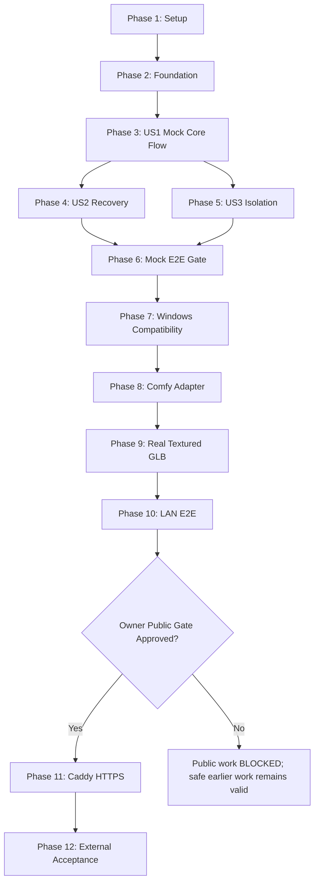

# Tasks: Local 3D Generation MVP

**Input**: `specs/001-local-3d-generation/` design artifacts  
**Feature ID**: `001-local-3d-generation`  
**Repository observation**: No application source exists yet. Paths below reuse
the approved structure in `plan.md`: `apps/api`, `apps/web`, `workflows`,
`fixtures`, `deploy`, `scripts`, and runtime-only `storage`.

**Completion rule**: A checkbox may change to `[x]` only after its stated command
or manual evidence passes. Writing code, configuration, a checklist, or a report
without passing the stated verification is not completion evidence.

**Test-first rule**: Test tasks in each phase are completed first by showing the
expected failing assertion. Implementation tasks then make those exact tests pass.

## Format: `[ID] [P?] [Story?] Description`

- **[P]**: Safe parallel work in different files with no dependency on an
  unfinished task in the same phase.
- **[US#]**: Requirement ownership from `spec.md`.
- Hardware tasks include the literal gate **Requires Windows NVIDIA server
  evidence.**
- Router, DNS, firewall, certificate, credential, or public-deployment tasks
  include the literal gate **Requires owner approval or owner-provided access.**

---

## Phase 1: Repository Setup and Shared Contracts

**Purpose**: Establish the approved monorepo layout and executable contract/tool
baselines without adding Post-MVP infrastructure.

- [X] T001 Initialize the Git repository and create root `.gitignore` entries for `.env*`, `storage/`, model weights, ComfyUI outputs, credentials, logs, caches, and build artifacts; complete when `git rev-parse --is-inside-work-tree` returns `true` and `git check-ignore storage/test .env.production` succeeds without tracking either path.
- [X] T002 [P] Create the Python 3.12 FastAPI package and pinned development tools in `apps/api/pyproject.toml` with source package `apps/api/src/local3d/__init__.py`; complete when `uv sync --project apps/api --group dev` and `uv run --project apps/api python -c "import local3d"` pass.
- [X] T003 [P] Create the Node.js 24/Next.js 16/React 19 project manifests in `apps/web/package.json`, `apps/web/package-lock.json`, `apps/web/tsconfig.json`, and `apps/web/next.config.ts`; complete when `npm --prefix apps/web ci` and `npm --prefix apps/web exec -- tsc --noEmit --project apps/web/tsconfig.json` pass.
- [X] T004 Create secret-free configuration templates in `.env.example`, `apps/api/.env.example`, and `apps/web/.env.example` with mock defaults and loopback-only internal URLs; complete when `rg -n "(password|secret|token|api_key)=[^<[:space:]]+" .env.example apps/*/.env.example` returns no real values and the templates contain no retained Public IP.
- [X] T005 [P] Implement OpenAPI and workflow-manifest static validation in `scripts/verify/validate_contracts.py`; complete when `uv run --project apps/api python scripts/verify/validate_contracts.py specs/001-local-3d-generation/contracts/openapi.yaml specs/001-local-3d-generation/contracts/comfyui-workflow-manifest.md` exits 0 and deliberately malformed temporary input exits non-zero.
- [X] T006 [P] Implement `scripts/verify/verify_fixture_manifest.py` and add supported, corrupt, spoofed-extension, and oversized image fixtures with provenance in `fixtures/inputs/README.md` and `fixtures/inputs/`; complete when `uv run --project apps/api python scripts/verify/verify_fixture_manifest.py fixtures/inputs/README.md` verifies every listed size and SHA-256 and a deliberately altered copy fails.
- [X] T007 [P] Implement the GLB inspection CLI in `scripts/verify/validate_glb.py` and add a redistributable known-good textured model with provenance in `fixtures/models/sample-textured.glb` and `fixtures/models/README.md`; complete when `uv run --project apps/api python scripts/verify/validate_glb.py fixtures/models/sample-textured.glb --require-mesh --require-uv --require-material --require-texture` passes, malformed/shape-only fixtures fail, and the recorded license permits repository use.

**Phase 1 exit criteria**: Dependency installation, contract validation, fixture
hash verification, and textured-GLB validation all pass from a clean checkout.

---

## Phase 2: Foundational State, Persistence, Storage, and Security

**Purpose**: Build the critical shared primitives that block every user story.

> Write T008, T010, T012, T014, and T017 first and retain their expected failing
> output before implementing the paired production modules.

- [X] T008 [P] Write configuration tests for mock/real adapter selection, 10 MiB limit, 24-hour retention, 10% disk threshold, loopback engine URL, and secret rejection in `apps/api/tests/unit/test_settings.py`; complete when `uv run --project apps/api pytest apps/api/tests/unit/test_settings.py` fails only because `local3d.config` is not implemented.
- [X] T009 Implement typed cross-platform settings in `apps/api/src/local3d/config.py`; complete when `uv run --project apps/api pytest apps/api/tests/unit/test_settings.py` passes on macOS and uses `pathlib.Path` without POSIX-only defaults.
- [X] T010 [P] Write exhaustive job-state and terminal-immutability tests in `apps/api/tests/unit/test_job_state.py`; complete when `uv run --project apps/api pytest apps/api/tests/unit/test_job_state.py` fails only because the domain state machine is absent.
- [X] T011 Implement `GenerationJob`, `JobAsset`, `JobEvent`, validated transitions, and safe error types in `apps/api/src/local3d/domain/jobs.py`; complete when `uv run --project apps/api pytest apps/api/tests/unit/test_job_state.py` passes every allowed and forbidden transition.
- [X] T012 [P] Write SQLite schema/repository tests for atomic acceptance, foreign keys, ordering, expiry, restart reads, busy timeout, and WAL version fallback in `apps/api/tests/unit/test_job_repository.py`; complete when `uv run --project apps/api pytest apps/api/tests/unit/test_job_repository.py` fails only because persistence code is absent.
- [X] T013 Implement schema migration and repositories in `apps/api/src/local3d/persistence/schema.sql`, `apps/api/src/local3d/persistence/database.py`, and `apps/api/src/local3d/persistence/jobs.py`; complete when `uv run --project apps/api pytest apps/api/tests/unit/test_job_repository.py` passes against a temporary SQLite database and reports rollback journal on an intentionally unsafe simulated SQLite version.
- [X] T014 [P] Write path traversal, symlink escape, atomic-write, per-job directory, and token-digest comparison tests in `apps/api/tests/unit/test_storage_and_tokens.py`; complete when `uv run --project apps/api pytest apps/api/tests/unit/test_storage_and_tokens.py` fails only because the storage/token modules are absent.
- [X] T015 Implement server-generated job paths, containment checks, atomic publish, quarantine, and cleanup primitives in `apps/api/src/local3d/storage/job_storage.py`; complete when the storage cases in `apps/api/tests/unit/test_storage_and_tokens.py` pass on macOS with temporary directories.
- [X] T016 Implement 256-bit job-token creation, digest-only persistence support, and constant-time verification in `apps/api/src/local3d/services/job_tokens.py`; complete when the token cases in `apps/api/tests/unit/test_storage_and_tokens.py` pass and `rg -n "job_token" apps/api/src/local3d` shows no raw-token logging or database field.
- [X] T017 [P] Write health, safe-error, and structured Job-ID logging tests in `apps/api/tests/contract/test_health_and_errors.py`; complete when `uv run --project apps/api pytest apps/api/tests/contract/test_health_and_errors.py` fails only because API bootstrap/error handlers are absent.
- [X] T018 Implement sanitized error mapping and structured logging in `apps/api/src/local3d/api/errors.py` and `apps/api/src/local3d/observability/logging.py`; complete when test logs contain Job IDs but no raw token, uploaded filename, private path, stack trace, or Basic credential.
- [X] T019 Implement FastAPI bootstrap, lifespan, `/api/v1/health/live`, and `/api/v1/health/ready` in `apps/api/src/local3d/main.py` and `apps/api/src/local3d/api/health.py`; complete when `uv run --project apps/api pytest apps/api/tests/contract/test_health_and_errors.py` passes and `uv run --project apps/api uvicorn local3d.main:app --host 127.0.0.1 --port 8000` serves both health routes locally.

**Phase 2 exit criteria**: Foundational tests pass; terminal states are immutable;
database recovery works; paths cannot escape storage; raw tokens never persist;
and health/errors leak no internal detail.

---

## Phase 3: User Story 1 — macOS Mock Upload, Preview, and Download (P1) 🎯

**Goal**: A local authorized evaluator uploads one valid image, receives an opaque
Job ID/token, reaches completion through the mock adapter, previews the textured
GLB with all controls, and downloads the same bytes.

**Independent test**: Run the API and browser in mock mode, complete one valid
flow, reject invalid fixtures before generation, operate rotate/zoom/pan/reset,
and compare preview/download SHA-256.

### Tests first

- [X] T020 [P] [US1] Write OpenAPI contract tests for create, status, model, download, cache headers, safe errors, and absence of engine IDs in `apps/api/tests/contract/test_jobs_api.py`; complete when `uv run --project apps/api pytest apps/api/tests/contract/test_jobs_api.py` fails at the unimplemented job routes while validating `specs/001-local-3d-generation/contracts/openapi.yaml`.
- [X] T021 [P] [US1] Write JPEG/PNG content, integrity, exact 10 MiB boundary, corrupt image, spoofed extension, bounded stream, and low-disk admission tests in `apps/api/tests/unit/test_upload_validation.py`; complete when `uv run --project apps/api pytest apps/api/tests/unit/test_upload_validation.py` fails only because `image_validation.py` is absent.
- [X] T022 [P] [US1] Write shared mock `GenerationAdapter` contract tests for success, candidate isolation, and opaque engine handles in `apps/api/tests/contract/test_generation_adapter.py`; complete when `GENERATION_ADAPTER=mock uv run --project apps/api pytest apps/api/tests/contract/test_generation_adapter.py` fails only because the adapter is absent.
- [X] T023 [P] [US1] Write GLB zero/multiple/malformed/shape-only/textured validation and atomic-publication tests in `apps/api/tests/unit/test_glb_publication.py`; complete when `uv run --project apps/api pytest apps/api/tests/unit/test_glb_publication.py` fails only because publication code is absent.
- [X] T024 [P] [US1] Write React Three Fiber viewer tests for load, rotate, zoom, pan, reset, loading, and invalid-model states in `apps/web/tests/unit/model-viewer.test.tsx`; complete when `npm --prefix apps/web run test -- model-viewer.test.tsx` fails on the missing viewer component.
- [X] T025 [P] [US1] Write frontend upload/API/download tests, including `X-Job-Token` and no query-token behavior, in `apps/web/tests/unit/generation-flow.test.tsx`; complete when `npm --prefix apps/web run test -- generation-flow.test.tsx` fails on missing UI/client modules.

### Implementation

- [X] T026 [P] [US1] Implement streamed JPEG/PNG validation, Pillow verify/reopen/load, exact size enforcement, and pre-queue disk admission in `apps/api/src/local3d/services/image_validation.py`; complete when `uv run --project apps/api pytest apps/api/tests/unit/test_upload_validation.py` passes all supported and rejected fixtures.
- [X] T027 [US1] Implement atomic job acceptance, UUID generation, one-time token return, asset/event persistence, and enqueue handoff in `apps/api/src/local3d/services/job_service.py`; complete when acceptance commits a queued job/input/event together and `uv run --project apps/api pytest apps/api/tests/contract/test_jobs_api.py -k create` passes.
- [X] T028 [P] [US1] Implement deterministic success/failure/missing/timeout modes using the textured fixture in `apps/api/src/local3d/adapters/generation/mock.py`; complete when `GENERATION_ADAPTER=mock uv run --project apps/api pytest apps/api/tests/contract/test_generation_adapter.py` passes without bypassing storage or publication code.
- [X] T029 [P] [US1] Implement textured-GLB structural validation, one-candidate enforcement, quarantine, and atomic publication in `apps/api/src/local3d/services/glb_publication.py`; complete when `uv run --project apps/api pytest apps/api/tests/unit/test_glb_publication.py` passes and shape-only output is rejected.
- [X] T030 [US1] Implement job creation/status/model/download routes and `X-Job-Token` authorization in `apps/api/src/local3d/api/jobs.py`; complete when `uv run --project apps/api pytest apps/api/tests/contract/test_jobs_api.py` passes and wrong/missing tokens receive the same 404 as unknown jobs.
- [X] T031 [P] [US1] Implement typed same-origin API calls and in-memory job token handling in `apps/web/lib/api/jobs.ts`; complete when `npm --prefix apps/web run test -- generation-flow.test.tsx` proves tokens appear only in `X-Job-Token`, not URLs or logs.
- [X] T032 [US1] Implement image selection, validation feedback, submit action, basic state display, and result navigation in `apps/web/app/page.tsx` and `apps/web/components/generation-form.tsx`; complete when the upload/UI assertions in `apps/web/tests/unit/generation-flow.test.tsx` pass.
- [X] T033 [P] [US1] Implement GLB preview, lighting, orbit controls, camera framing/reset, error boundary, and cleanup of object URLs in `apps/web/components/model-viewer.tsx`; complete when `npm --prefix apps/web run test -- model-viewer.test.tsx` passes all rotate/zoom/pan/reset cases.
- [X] T034 [US1] Integrate preview and byte-identical download in `apps/web/components/generation-result.tsx`; complete when `uv run --project apps/api pytest apps/api/tests/contract/test_jobs_api.py` and `npm --prefix apps/web run test` both pass and a manual mock flow records matching preview/download SHA-256 in `evidence/mock/us1-manual.md`.

**Phase 3 exit criteria**: US1 passes independently in mock mode with one valid
image and every rejected upload; preview controls work and downloaded bytes match
the validated published GLB.

---

## Phase 4: User Story 2 — State, Progress, Failure, and Recovery (P2)

**Goal**: The same job survives refresh/reconnect, exposes only supported progress,
and reaches a safe terminal outcome for failure, timeout, or missing output.

**Independent test**: Drive each state and failure mode with the mock adapter,
restart the backend, and recover the same Job ID without engine-detail leakage.

### Tests first

- [X] T035 [P] [US2] Extend transition, safe-failure, progress-nullability, approximate-queue, and result-readiness API tests in `apps/api/tests/contract/test_job_status_and_failures.py`; complete when `uv run --project apps/api pytest apps/api/tests/contract/test_job_status_and_failures.py` fails on missing coordinator behavior only.
- [X] T036 [P] [US2] Write adapter timeout, missing-output, disconnect, uncertain-result, cancellation, and restart-reconciliation tests in `apps/api/tests/integration/test_adapter_recovery.py`; complete when `uv run --project apps/api pytest apps/api/tests/integration/test_adapter_recovery.py` fails on absent recovery code without submitting duplicates.
- [X] T037 [P] [US2] Write polling, 2-second-to-backoff timing, refresh bootstrap, terminal stop, and safe-failure UI tests in `apps/web/tests/unit/job-status.test.tsx`; complete when `npm --prefix apps/web run test -- job-status.test.tsx` fails on missing polling/status modules.

### Implementation

- [X] T038 [US2] Implement observation-to-state mapping, evidence-backed progress, safe terminal errors, timeout handling, and single-result completion in `apps/api/src/local3d/services/generation_coordinator.py`; complete when `uv run --project apps/api pytest apps/api/tests/contract/test_job_status_and_failures.py` passes and no exact progress is invented.
- [X] T039 [US2] Implement startup reconciliation for queued/processing/completed jobs without automatic duplicate resubmission in `apps/api/src/local3d/services/recovery.py`; complete when `uv run --project apps/api pytest apps/api/tests/integration/test_adapter_recovery.py` passes all disconnect/restart/unknown-result cases.
- [X] T040 [P] [US2] Implement refresh-safe polling with terminal stop and 2-second then 5–10-second backoff in `apps/web/lib/jobs/use-job-status.ts`; complete when the timing and reconnect assertions in `apps/web/tests/unit/job-status.test.tsx` pass with fake timers.
- [X] T041 [US2] Implement queued, processing, completed, failed, cancelled, approximate/unknown progress, and recovery UI in `apps/web/components/job-status.tsx`; complete when `npm --prefix apps/web run test -- job-status.test.tsx` passes without rendering internal paths, traces, prompt IDs, or false precision.
- [X] T042 [US2] Add controlled failure/restart integration scenarios in `apps/api/tests/integration/test_job_lifecycle.py`; complete when `GENERATION_ADAPTER=mock uv run --project apps/api pytest apps/api/tests/integration/test_job_lifecycle.py` passes and proves missing GLB never produces a result URL.
- [X] T043 [US2] Execute the US2 verification and record output in `evidence/mock/us2-recovery.md`; complete only when `uv run --project apps/api pytest apps/api/tests/unit/test_job_state.py apps/api/tests/integration/test_adapter_recovery.py apps/api/tests/integration/test_job_lifecycle.py` and `npm --prefix apps/web run test -- job-status.test.tsx` all pass.

**Phase 4 exit criteria**: Every mock lifecycle is terminal or recoverable after
restart; refresh returns the same job; incomplete output is never served.

---

## Phase 5: User Story 3 — Serial Queue and Cross-Job Isolation (P3)

**Goal**: Two users may submit concurrently while only one job executes, and no
token, path, status, or output crosses job boundaries.

**Independent test**: Submit two distinct fixtures, hold the first active, prove
the second waits, exchange tokens/IDs deliberately, and verify zero disclosure or
overwrite through completion and restart.

### Tests first

- [X] T044 [P] [US3] Write deterministic FIFO, one-active-job, approximate-position, and active-job-low-disk continuation tests in `apps/api/tests/unit/test_serial_dispatcher.py`; complete when `uv run --project apps/api pytest apps/api/tests/unit/test_serial_dispatcher.py` fails only because the dispatcher is absent.
- [X] T045 [P] [US3] Write traversal, symlink, guessed UUID, swapped token, cross-job status/model/download, and uniform-404 tests in `apps/api/tests/security/test_job_isolation.py`; complete when `uv run --project apps/api pytest apps/api/tests/security/test_job_isolation.py` exposes the missing isolation enforcement and no fixture escapes the temporary root.
- [X] T046 [P] [US3] Write duplicate submission, adapter retry, idempotency-key, restart, and conflicting-output tests in `apps/api/tests/integration/test_duplicate_safety.py`; complete when `uv run --project apps/api pytest apps/api/tests/integration/test_duplicate_safety.py` fails before implementation and asserts no second engine execution for one internal idempotency key.
- [X] T047 [P] [US3] Write a two-user concurrent API integration test in `apps/api/tests/integration/test_two_user_queue.py`; complete when it fails on missing serial orchestration while already asserting distinct Job IDs, tokens, folders, and results.

### Implementation

- [X] T048 [US3] Implement one-process FIFO admission and exactly-one-active dispatcher in `apps/api/src/local3d/services/serial_dispatcher.py`; complete when `uv run --project apps/api pytest apps/api/tests/unit/test_serial_dispatcher.py` passes and observed adapter concurrency never exceeds one.
- [X] T049 [P] [US3] Centralize uniform job-token authorization and expiry handling in `apps/api/src/local3d/api/dependencies.py`; complete when `uv run --project apps/api pytest apps/api/tests/security/test_job_isolation.py` returns indistinguishable 404 bodies/timing bounds for unknown, expired, missing, and wrong-token access.
- [X] T050 [US3] Implement durable internal idempotency guards and conflict-safe output publication in `apps/api/src/local3d/services/generation_coordinator.py`; complete when `uv run --project apps/api pytest apps/api/tests/integration/test_duplicate_safety.py` passes without overwriting or attaching another job's GLB.
- [X] T051 [US3] Enforce same-job asset relationships and per-job result serving in `apps/api/src/local3d/services/job_service.py`; complete when `uv run --project apps/api pytest apps/api/tests/security/test_job_isolation.py apps/api/tests/integration/test_two_user_queue.py` passes.
- [X] T052 [US3] Execute the two-user/isolation gate and record hashes, Job IDs, and sanitized logs in `evidence/mock/us3-isolation.md`; complete only when `uv run --project apps/api pytest apps/api/tests/unit/test_serial_dispatcher.py apps/api/tests/security/test_job_isolation.py apps/api/tests/integration/test_duplicate_safety.py apps/api/tests/integration/test_two_user_queue.py` passes with zero cross-job access.

**Phase 5 exit criteria**: Two submissions produce two isolated jobs and outputs,
execution concurrency stays one, and duplicate/restart paths create no conflicts.

---

## Phase 6: First Shippable Slice — macOS Mock End-to-End Gate

**Purpose**: Ship the first independently demonstrable artifact: browser upload →
mock queue/progress → textured sample GLB preview → download.

- [X] T053 [P] [US1] Write the Playwright happy-path/upload/viewer/download test in `apps/web/tests/e2e/mock-happy-path.spec.ts`; complete when `npm --prefix apps/web run test:e2e -- mock-happy-path.spec.ts` initially fails only because the E2E orchestration is not wired.
- [X] T054 [P] [US2] Write Playwright refresh, reconnect, safe failure, missing GLB, and terminal-state tests in `apps/web/tests/e2e/mock-recovery.spec.ts`; complete when the spec initially fails only at missing runtime orchestration, not at test syntax or fixture loading.
- [X] T055 [P] [US3] Write Playwright two-session queue and cross-job access tests in `apps/web/tests/e2e/mock-isolation.spec.ts`; complete when the spec initially fails only at missing runtime orchestration and includes swapped-token/ID attempts.
- [X] T056 [US1] Implement cross-platform mock E2E orchestration in `apps/web/playwright.config.ts` and `scripts/dev/run_mock_e2e.py`; complete when `GENERATION_ADAPTER=mock npm --prefix apps/web run test:e2e` passes T053–T055 without direct browser calls to port 8188.
- [X] T057 Run all macOS mock checks and record commands, versions, and artifacts in `evidence/mock/phase-6-gate.md`; complete only when `uv run --project apps/api pytest`, `uv run --project apps/api ruff check .`, `uv run --project apps/api mypy apps/api/src`, `npm --prefix apps/web run test`, `npm --prefix apps/web run typecheck`, `npm --prefix apps/web run lint`, `npm --prefix apps/web run build`, and `npm --prefix apps/web run test:e2e` all pass.

**Phase 6 exit criteria — first shippable slice**: All mock automated checks pass
from a clean setup; the artifact is demonstrable on macOS but makes no real-GPU,
LAN, or Internet claim.

---

## Phase 7: Windows ComfyUI and Hunyuan3D Compatibility Validation

**Purpose**: Prove the target machine can run the pinned engine before writing
the production adapter. Consult `docs/reference/ai-runtime-sources.md`.

- [ ] T058 Create and execute hardware/runtime inventory capture in `scripts/windows/capture_gpu_baseline.ps1` with output in `evidence/windows/gpu-baseline.md`; complete only when GPU model, driver, VRAM, Windows version, Python, PyTorch, CUDA availability, and SQLite version are captured and reviewed. **Requires Windows NVIDIA server evidence.**
- [ ] T059 Install and pin ComfyUI plus required custom-node revisions in `workflows/hunyuan3d/workflow-manifest.json`; complete only when recorded commits/hashes match the running `127.0.0.1:8188` instance and a post-restart health request succeeds—configuration text alone is insufficient. **Requires Windows NVIDIA server evidence.**
- [ ] T060 Execute PyTorch/CUDA/native-wheel compatibility checks from `scripts/windows/verify_hunyuan_runtime.ps1` and store output in `evidence/windows/runtime-compatibility.md`; complete only when CUDA is available, the intended GPU is selected, imports succeed, and no dependency is silently upgraded. **Requires Windows NVIDIA server evidence.**
- [ ] T061 Export and run the native Hunyuan3D 2.1 shape smoke workflow in `workflows/hunyuan3d/editable/hunyuan3d-21-shape-smoke.json` and `workflows/hunyuan3d/api/hunyuan3d-21-shape-smoke.json`; complete only when API submission generates a parseable shape artifact recorded in `evidence/windows/shape-smoke.md`, explicitly marked not MVP textured-GLB completion. **Requires Windows NVIDIA server evidence.**
- [ ] T062 Implement and execute manifest/hash/`/object_info` compatibility verification in `scripts/verify/verify_comfy_manifest.py`; complete only when the pinned running instance passes and deliberate node/hash mismatch fixtures fail closed with evidence in `evidence/windows/object-info-check.md`. **Requires Windows NVIDIA server evidence.**
- [ ] T063 Create and execute the Windows GPU generation checklist in `docs/operations/windows-gpu-validation.md`; complete only when every prerequisite and shape-smoke item has command output/artifact paths and an explicit PASS/FAIL/BLOCKED verdict. **Requires Windows NVIDIA server evidence.**
- [ ] T064 Issue the compatibility gate verdict in `evidence/windows/phase-7-gate.md`; complete only when T058–T063 are PASS, or record BLOCKED with the exact failing dependency and smallest owner action. **Requires Windows NVIDIA server evidence.**

**Phase 7 exit criteria**: The pinned runtime and required nodes are compatible on
the real server. A shape smoke PASS unlocks adapter work but does not satisfy MVP.

---

## Phase 8: FastAPI-to-ComfyUI Adapter and Workflow Mapping

**Goal**: Replace the mock behind the same contract without exposing ComfyUI
protocols or identifiers to the frontend.

### Tests first

- [X] T065 [P] [US2] Write mocked `/prompt`, `/queue`, `/history`, WebSocket disconnect, timeout, and restart tests in `apps/api/tests/contract/test_comfy_client.py`; complete when `uv run --project apps/api pytest apps/api/tests/contract/test_comfy_client.py` fails only because the Comfy client is absent.
- [X] T066 [P] [US1] Write immutable workflow loading and allowlisted input/output injection tests in `apps/api/tests/unit/test_workflow_mapping.py`; complete when `uv run --project apps/api pytest apps/api/tests/unit/test_workflow_mapping.py` fails only because the mapper is absent and rejects mutations outside approved node fields.
- [X] T067 [P] [US3] Write zero/one/multiple result discovery, job-prefix containment, and stale-file rejection tests in `apps/api/tests/unit/test_comfy_output_discovery.py`; complete when `uv run --project apps/api pytest apps/api/tests/unit/test_comfy_output_discovery.py` fails only because the resolver is absent.
- [ ] T068 [US1] Create the hardware-gated real adapter smoke test in `apps/api/tests/integration/test_comfy_adapter_smoke.py`; complete when test collection passes on macOS with a documented skip and fails at the expected missing adapter/runtime assertion on the Windows test environment. **Requires Windows NVIDIA server evidence.**

### Implementation

- [X] T069 [P] [US2] Implement loopback-only ComfyUI HTTP/WebSocket client and reconciliation methods in `apps/api/src/local3d/adapters/generation/comfy_client.py`; complete when `uv run --project apps/api pytest apps/api/tests/contract/test_comfy_client.py` passes without returning prompt IDs through public models.
- [X] T070 [P] [US1] Implement manifest-pinned API workflow loading and allowlisted mapping in `apps/api/src/local3d/adapters/generation/workflow_mapper.py`; complete when `uv run --project apps/api pytest apps/api/tests/unit/test_workflow_mapping.py` passes and the source workflow hash remains unchanged.
- [X] T071 [P] [US3] Implement strict per-job ComfyUI output resolution in `apps/api/src/local3d/adapters/generation/output_resolver.py`; complete when `uv run --project apps/api pytest apps/api/tests/unit/test_comfy_output_discovery.py` passes all zero/multiple/traversal/stale cases.
- [ ] T072 [US1] Implement the real `GenerationAdapter` in `apps/api/src/local3d/adapters/generation/comfy.py`; complete when the shared adapter suite `GENERATION_ADAPTER=comfy uv run --project apps/api pytest apps/api/tests/contract/test_generation_adapter.py` passes against the controlled Windows instance. **Requires Windows NVIDIA server evidence.**
- [ ] T073 [US2] Wire manifest verification, adapter selection, readiness fail-closed, and startup reconciliation in `apps/api/src/local3d/adapters/generation/factory.py` and `apps/api/src/local3d/main.py`; complete when mock tests remain green and an invalid real manifest makes `/api/v1/health/ready` return safe 503. **Requires Windows NVIDIA server evidence.**
- [ ] T074 [US1] Execute the real ComfyUI integration smoke test and store sanitized request/result evidence in `evidence/windows/comfy-adapter-smoke.md`; complete only when `RUN_COMFY_INTEGRATION=1 uv run --project apps/api pytest apps/api/tests/integration/test_comfy_adapter_smoke.py` passes with ComfyUI bound to loopback. **Requires Windows NVIDIA server evidence.**

**Phase 8 exit criteria**: Mock and real adapters satisfy one contract; workflow
mutation is allowlisted; disconnect/restart reconciles without duplicate work;
ComfyUI remains private.

---

## Phase 9: Real GPU Textured-GLB Generation Validation

**Purpose**: Prove the actual MVP result, not merely shape generation.

- [ ] T075 [US1] Pin and execute the full shape-plus-texture API workflow in `workflows/hunyuan3d/editable/hunyuan3d-textured-glb.json` and `workflows/hunyuan3d/api/hunyuan3d-textured-glb.json`; complete only when one API-submitted job creates exactly one non-empty candidate GLB and evidence is retained in `evidence/windows/textured-generation-1.md`. **Requires Windows NVIDIA server evidence.**
- [ ] T076 [US1] Validate the real result with `scripts/verify/validate_glb.py` and record mesh, primitive, UV, material, texture, size, and SHA-256 data in `evidence/windows/textured-glb-validation.md`; complete only when every required GLB property passes. **Requires Windows NVIDIA server evidence.**
- [ ] T077 [US3] Execute two distinct jobs serially and capture adapter concurrency, input/output paths, Job IDs, hashes, duration, peak VRAM, and overwrite checks in `evidence/windows/two-job-serial.md`; complete only when both textured GLBs pass validation, remain isolated, and maximum active GPU jobs equals one. **Requires Windows NVIDIA server evidence.**
- [ ] T078 [US2] Execute controlled engine failure, timeout, disconnect, missing output, backend restart, and ComfyUI restart cases using `scripts/windows/run_recovery_matrix.ps1`; complete only when `evidence/windows/recovery-matrix.md` shows safe terminal/reconciled states and zero duplicate executions. **Requires Windows NVIDIA server evidence.**
- [ ] T079 [US1] Record the real-GPU phase verdict and pinned revision/hash set in `evidence/windows/phase-9-gate.md`; complete only when T075–T078 are PASS and shape-only evidence is not used as textured completion. **Requires Windows NVIDIA server evidence.**

**Phase 9 exit criteria**: Two real, isolated, textured GLBs pass structural
validation without OOM or concurrency above one; failure/restart paths are safe.

---

## Phase 10: LAN End-to-End Deployment

**Purpose**: Prove the real flow from another LAN device before any public change.

- [ ] T080 [US1] Create WinSW service definitions and loopback bindings in `deploy/windows/services/api.xml`, `deploy/windows/services/web.xml`, and `deploy/windows/services/comfyui.xml`; complete only when `scripts/windows/verify_services.ps1` records restricted identities, dependency order, healthy services, and a successful post-service real generation in `evidence/lan/service-startup.md`. **Requires Windows NVIDIA server evidence.**
- [ ] T081 [US2] Execute machine reboot and non-terminal recovery using `scripts/windows/verify_reboot_recovery.ps1`; complete only when `evidence/lan/reboot-recovery.md` proves automatic startup, state reconciliation, and a new successful job without manually opening terminals. **Requires Windows NVIDIA server evidence.**
- [ ] T082 [US1] Create and execute the LAN full-flow checklist in `docs/operations/lan-acceptance.md`; complete only when a second LAN device performs upload → queued/processing → textured preview controls → byte-identical download and evidence is stored in `evidence/lan/full-flow.md`. **Requires Windows NVIDIA server evidence.**
- [ ] T083 [US3] Create and execute the LAN security checklist in `docs/operations/lan-security-checklist.md` using `scripts/verify/test_lan_boundary.py`; complete only when `evidence/lan/isolation-and-ports.md` proves cross-job denial and that ports 8000 and 8188 are unreachable from the LAN client while the approved LAN entry path works. **Requires Windows NVIDIA server evidence. Requires owner approval or owner-provided access.**
- [ ] T084 [US1] Record the LAN gate verdict in `evidence/lan/phase-10-gate.md`; complete only when T080–T083 are PASS with commands, timestamps, Job IDs, logs, screenshots, and GLB hashes. **Requires Windows NVIDIA server evidence.**

**Phase 10 exit criteria**: Real end-to-end flow passes from a second LAN device,
service/reboot recovery passes, and ComfyUI/backend are not directly reachable.

---

## Phase 11: User Story 4 — Protected Caddy HTTPS Deployment (P4)

**Hard gate**: The approved access control is shared Caddy credentials plus
per-job `X-Job-Token`. Stop this phase if that decision is absent or superseded.
Do not expose ports 3000, 8000, 8188, or 3389.

**Independent test**: An authorized external user completes the core flow through
HTTPS; unauthenticated access is rejected; external probes reach only approved
80/443 behavior.

### Tests first

- [ ] T085 [US4] Record owner approval for model-license/territory scope, domain or DDNS, credential owner, current Public-IP revalidation, static/dynamic and CGNAT status, and router 80/443 capability in `evidence/public-deployment/owner-gate.md`; complete only when every decision is explicitly approved or the phase is marked BLOCKED without changing public infrastructure. **Requires owner approval or owner-provided access.**
- [ ] T086 [P] [US4] Write Caddy configuration contract tests for HTTPS-only application access, Basic auth, request-body limit, `/api` proxying, Basic `Authorization` stripping, and forbidden public upstream binds in `tests/security/test_caddy_contract.py`; complete when `uv run --project apps/api pytest tests/security/test_caddy_contract.py` fails against the missing Caddy configuration and includes assertions banning public 3000/8000/8188/3389. **Requires owner approval or owner-provided access.**

### Deployment and verification

- [ ] T087 [US4] Implement the Caddy configuration with hashed credential environment injection in `deploy/caddy/Caddyfile` and `deploy/caddy/.env.example`; complete only when `caddy validate --config deploy/caddy/Caddyfile`, T086, authenticated HTTPS routing, and Basic-header stripping tests pass without committing credentials. **Requires owner approval or owner-provided access.**
- [ ] T088 [US4] Implement least-privilege Windows Defender Firewall rules in `deploy/firewall/configure-public-boundary.ps1` and a read-only verifier in `deploy/firewall/verify-public-boundary.ps1`; complete only when the verifier records 443 allowed, optional 80 limited to redirect/certificate, and 3000/8000/8188/3389 blocked in `evidence/public-deployment/firewall.md`. **Requires Windows NVIDIA server evidence. Requires owner approval or owner-provided access.**
- [ ] T089 [US4] Apply owner-approved DNS/DDNS and router forwarding only for 80/443 and record redacted before/after evidence in `evidence/public-deployment/dns-router.md`; complete only when public DNS resolves to the revalidated current Public IP, no CGNAT/routing blocker remains, and no internal port forward exists. **Requires owner approval or owner-provided access.**
- [ ] T090 [US4] Obtain and validate the public certificate and redirect behavior with `scripts/verify/test_https_boundary.py`; complete only when `evidence/public-deployment/tls.md` records trusted hostname validation, HTTPS 443 success, HTTP 80 redirect/certificate-only behavior, and no certificate warnings. **Requires owner approval or owner-provided access.**
- [ ] T091 [US4] Execute shared-credential and per-job-token boundary tests from an external client using `scripts/verify/test_public_auth.py`; complete only when unauthenticated requests are refused before job creation, authorized requests work, wrong-job tokens return uniform 404, and no credential/token appears in captured URLs or logs in `evidence/public-deployment/auth.md`. **Requires owner approval or owner-provided access.**
- [ ] T092 [US4] Execute an external TCP/service scan using `scripts/verify/test_external_ports.py`; complete only when `evidence/public-deployment/ports.md` shows expected 443, optional 80 behavior, and failed connections to 3000, 8000, 8188, and 3389. **Requires owner approval or owner-provided access.**

**Phase 11 exit criteria**: Owner gate is approved; TLS and two-layer access
control pass; only the intended public entry is reachable; no secret is committed.

---

## Phase 12: External-Network Acceptance and Operator Runbook

**Purpose**: Close the Definition of Done with real user and operator evidence.

- [ ] T093 [US4] Execute the external-network full-flow acceptance checklist in `docs/operations/external-acceptance.md`; complete only when `evidence/public-deployment/full-flow.md` records an authorized upload, real queue/process state, textured preview with rotate/zoom/pan/reset, and byte-identical GLB download through HTTPS. **Requires Windows NVIDIA server evidence. Requires owner approval or owner-provided access.**
- [ ] T094 [US4] Create and execute the external-network security checklist in `docs/operations/external-network-security-checklist.md` using `scripts/verify/test_external_acceptance.py` for unauthorized, wrong-token, expired-job, invalid upload, low-disk admission, and internal-port cases; complete only when `evidence/public-deployment/negative-cases.md` records safe expected responses and zero information leakage. **Requires owner approval or owner-provided access.**
- [ ] T095 [US2] Create and exercise the operator health/recovery/cleanup runbook in `docs/operations/operator-runbook.md`; complete only when `evidence/operations/runbook-drill.md` traces Job IDs across submission, queue, processing, result, download, failure, restart, 24-hour expiry, and low-disk recovery without exposing user content or secrets. **Requires Windows NVIDIA server evidence.**
- [ ] T096 [US4] Produce the final criterion-to-evidence acceptance matrix in `evidence/final/mvp-acceptance.md`; complete only when every SC-001–SC-007 and FR-001–FR-018 maps to current passing automated/manual evidence, all unresolved items are marked BLOCKED, and no checkbox/report alone is treated as proof. **Requires owner approval or owner-provided access.**
- [ ] T097 Run the final constitution and scope audit against `.specify/memory/constitution.md` and record it in `evidence/final/constitution-audit.md`; complete only when no Post-MVP component was added, all exceptions contain reason/risk/owner/review trigger, internal ports remain private, and the verdict is PASS or honestly BLOCKED.

**Phase 12 exit criteria**: External core flow, negative security checks, operator
recovery drill, requirement evidence matrix, and constitution audit all pass.

---

## Dependency Graph

### Story dependencies

- **US1** starts after Phase 2 and creates the basic mock flow.
- **US2** and **US3** both extend US1 but are independently verified with their
  own fixtures and tests; they may proceed in parallel after Phase 3.
- **US4** depends on passing real GPU and LAN gates plus explicit owner approval.
- Public tasks stop at T085 if access control, license/territory, domain/DDNS,
  router, or credential ownership is unresolved.

## Safe Parallel Opportunities

| After dependency | Parallel tasks | Why safe |
|---|---|---|
| T001 | T002, T003, T005, T006, T007 | Separate backend, frontend, validators, and fixtures |
| Phase 1 | T008, T010, T012, T014, T017 | Test files cover independent foundational modules |
| Phase 2 | T020–T025 | Backend contracts, validation, adapter, GLB, viewer, and UI tests are separate |
| T025 | T026, T028, T029, T031, T033 | Separate implementation modules; T027/T030 integrate later |
| Phase 3 | T035–T037 and T044–T047 | US2 recovery and US3 isolation tests use separate files |
| T057 | T058 preparation and non-mutating source review | macOS slice is sealed; Windows evidence is separate |
| T064 | T065–T068 | Adapter contract, mapping, resolver, and smoke-test files are separate |
| T068 | T069–T071 | Client, mapper, and output resolver implementations are independent |
| T085 | T086 and preparation of redacted evidence templates | No public change occurs before the owner gate passes |

Parallel markers never authorize two agents to edit the same file, run two GPU
jobs concurrently, change router/firewall/DNS without owner access, or mix maker
and evidence verdict roles.

## Verification and Implementation Strategy

### First shippable slice

Complete Phases 1–6, then stop and demonstrate the macOS mock flow. This is the
first usable, fully automated slice and does not claim real AI or public readiness.

### Incremental delivery

1. Setup + foundation → critical contracts and isolation primitives.
2. US1 → one complete mock upload/preview/download flow.
3. US2 + US3 → recovery, truthful status, serial queue, and isolation.
4. Mock E2E gate → first shippable slice.
5. Windows compatibility → actual runtime proof.
6. Real adapter + textured GPU gate → actual local generation proof.
7. LAN gate → real local product proof.
8. Owner public gate + Caddy/security → protected Internet proof.
9. External acceptance + operator drill → MVP Definition of Done.

## Requirement and User-Story Traceability

| Requirement | Implementation task(s) | Verification task(s) |
|---|---|---|
| US1 / FR-001 | T027, T030, T032 | T020, T034, T053, T093 |
| FR-002 | T026 | T021, T094 |
| FR-003 | T027 | T020, T047 |
| FR-004 | T011, T038 | T010, T035, T042 |
| US2 / FR-005 | T038, T040, T041 | T035, T037, T042, T054 |
| FR-006 | T029, T030, T072, T075 | T023, T034, T074, T076, T093 |
| FR-007 | T033, T034 | T024, T053, T093 |
| US3 / FR-008 | T015, T048, T051, T071 | T014, T045, T047, T052, T077 |
| FR-009 | T016, T030, T049 | T045, T055, T091, T094 |
| FR-010 | T048 | T044, T047, T077 |
| FR-011 | T038, T041 | T035, T037, T054 |
| FR-012 | T018, T026, T038, T041 | T017, T021, T035, T036, T078, T094 |
| FR-013 | T013, T039 | T012, T036, T042, T081, T095 |
| FR-014 | T018, T019, T095 | T017, T043, T078, T095, T096 |
| US4 / FR-015 | T087, T088, T089 | T086, T090, T092, T093 |
| FR-016 | T016, T030, T049, T087 | T014, T020, T045, T086, T091, T094 |
| FR-017 | T013 | T012, T081, T095 |
| FR-018 | T015, T026, T095 | T021, T044, T094, T095 |

## Final Scope Guard

These tasks intentionally exclude payment, billing, application accounts,
PostgreSQL, Redis, Kubernetes, containers, microservices, cloud GPU, object
storage, multi-GPU, autoscaling, mobile applications, and advanced 3D editing.
Any proposal to add one requires a new approved specification/plan amendment.
