# Feature Specification: Zero-Cost Local AI Public Server

**Feature Branch**: `003-outbound-tunnel-entry`

**Created**: 2026-09-05

**Status**: Ready for planning

**Input**: User description: "Promote the existing LAN-only local 3D AI service into a public AI server using the project PC, an outbound Cloudflare Tunnel, Cloudflare's public edge, and a browser-facing web application, with zero additional cost."

**Supersedes**: The public-entry architecture in `002-cloudflare-public-entry`. Feature 001's job, authorization, storage, queue, and AI-generation behavior remains authoritative unless this specification explicitly strengthens it.

## Owner Decisions

- The server address covered by the project's institutional approval MUST remain part of the production application path. It is not a nominal address and may not be reduced to a fallback-only role.
- Cloudflare Tunnel is the owner-selected public connector. The connector MUST originate from the approved server side and MUST NOT require public port forwarding to the server.
- The project may use only existing hardware, storage, Internet access, electricity, and the institutionally supplied address. Every newly introduced software, tunnel, public-name, certificate, protection, monitoring, and recovery dependency MUST add zero project-attributable cost.
- The project MUST NOT purchase or renew a domain. `twin3dgen.mangosgo.com` is the preferred production candidate, used under authorization from the third-party owner of `mangosgo.com` at no cost to this project. It is not accepted until that authorization is granted and the tunnel route is created inside the Cloudflare account that manages `mangosgo.com`.
- zrok was evaluated against every mandatory constraint and passes the technical zero-cost feasibility gate. It is NOT selected as the preferred production route, because its no-card hosted experience shows visitors a recurring interstitial page. zrok is retained as a zero-cost development, demo, and contingency fallback, not as a rejected option.
- The zrok fallback is scoped by cause. If the preferred hostname is never authorized, production MUST NOT launch through zrok. If an already-live production hostname is later withdrawn, zrok MAY be activated as a temporary degraded-production continuity route with its interstitial accepted.
- The public user experience keeps the existing no-site-wide-login model. Per-job capability tokens remain required for private job status and output access.

## Clarifications

### Session 2026-09-05

- Q: Are the institutionally approved address (`161.200.90.4`) and the RTX 5070 GPU role on the same physical machine, or on two different machines? → A: Different machines. The approved origin is the lab server holding `161.200.90.4`; it runs the tunnel connector and web entry only. The RTX 5070 GPU role stays on the laptop (`LAPTOP-9PI3K9F7`) and is reached solely through the existing narrow private binding carried forward from feature 002. FR-014 (split profile) governs production deployment; FR-013 (single-host default) is not applicable unless later origin evidence shows the address moves onto the GPU machine itself.
- Q: Under the split profile, which components run on the approved origin, and which stay on the GPU laptop? → A: Thin origin. The approved origin runs only the tunnel connector and a stateless public HTTP pass-through. The GPU laptop runs the entire feature 001 application: job service, serial queue, SQLite job state, uploaded inputs, generated artifacts, retention/cleanup, disk-space gating, and the AI engine. Feature 001's storage and retention behavior is unchanged and does not move to the lab server. "Web entry" in FR-014 means the origin-side public HTTP entry point, not feature 001's application server.
- Q: When the entire approved origin is offline — server powered off, or the tunnel connector down — should visitors see Cloudflare's own error page, or a project-controlled maintenance page? → A: The provider's own error page is accepted for a fully-offline origin. Project-controlled unavailable responses are required only for failures the origin can still serve: AI engine down, private binding down, or job service down while the origin and connector remain healthy. No edge-hosted maintenance page is introduced, so no public route bypasses the approved origin and FR-002 remains absolute.
- Q: Which zero-cost mechanism should the plan assume for pointing the public hostname at the tunnel, given partial CNAME setup is paid? → A: Change the candidate hostname to `twin3dgen.eu.org`. Plan for a free EU.org registration delegated by `NS` record to a full Cloudflare zone on the free plan, with the tunnel's DNS route created inside that same Cloudflare account. `inw3dgen.is-a.dev` is withdrawn as the candidate. Cloudflare partial (CNAME) setup is excluded because it requires a Business plan and fails the zero-cost gate. The hostname stays pending until EU.org approval and Cloudflare onboarding are both verified. **Superseded 2026-09-06 — see the hosting re-evaluation below; EU.org is withdrawn.**
- Q: Must the tunnel connector's outbound traffic be verified to egress from the approved address, or is it enough that the machine holding that address runs the connector? → A: Egress-verified. Cutover evidence MUST show, via the Cloudflare Tunnel connections API, that the active connector reports `origin_ip = 161.200.90.4`. This check is repeated whenever the approved origin's network configuration changes. Binding the connector's source address is NOT required at this stage; that decision is deferred until the lab server is inspected and confirms the approved address is directly bindable on the origin.

### Session 2026-09-06 — public-hosting re-evaluation

An owner-directed feasibility review compared open-source public-sharing options against every mandatory constraint.

- **zrok result — PASS on feasibility, NOT selected as production.** zrok (Apache-2.0, v2.0.4) satisfies the hard zero-cost gate: a genuine $0 plan, no mandatory payment card, no manual approval, a provider-supplied HTTPS hostname of the form `https://<name>.share.zrok.io`, automatic TLS, outbound-only connectivity, Windows support, and reserved names that survive restart. Its 5 GB/day free allowance is sufficient for realistic project load. It is not chosen for production because free operation without a payment card shows external visitors a recurring interstitial page, which is unacceptable for the preferred production experience. **This is a user-experience and naming preference, not a failure of zrok.**
- **Other open-source candidates rejected on hard constraints.** rathole, frp, and boringproxy provide no free hosted public relay, so production would require either a paid VPS or a new inbound public port on the approved origin — both prohibited. `bore` offers only TCP through a shared relay with a random port and no HTTPS or stable name.
- Q: Which public hosting route is preferred for production, given the zrok interstitial? → A: Cloudflare Tunnel with the hostname `twin3dgen.mangosgo.com`, conditional on authorization from the `mangosgo.com` owner and creation of the tunnel route inside the Cloudflare account that manages that domain. `twin3dgen.eu.org` and the EU.org registration path are withdrawn. The project pays nothing for the domain. zrok is retained as the zero-cost fallback if this route is refused or cannot be created.
- Q: May implementation proceed while the `mangosgo.com` authorization is outstanding? → A: Yes. Work on the approved origin, stateless pass-through, private binding, GPU application, firewall, layered health checks, and recovery MUST NOT be blocked on the naming decision. A Cloudflare Quick Tunnel MAY be used for temporary external development and testing only, never as the production identity.
- Q: If the preferred hostname is refused or withdrawn, is zrok's interstitial acceptable as a fallback? → A: Split by cause. Never authorized before cutover → production does not launch through zrok; the public release stays blocked and the service remains LAN-only, with zrok and Quick Tunnel limited to development and demo. Already live and later withdrawn → zrok may be activated as a temporary degraded-production continuity route with its interstitial accepted, recording the degraded state and replacing it with an approved stable hostname within an owner-defined recovery window.
- Q: Does the GPU laptop's startup depend on the private binding? → A: No. The feature 001 application MUST start and run independently of the approved origin and the private binding (FR-023a), and no service may bind exclusively to the private-binding address (FR-023d). Losing the binding blocks public traffic only; the LAN workflow keeps working. Repository evidence shows feature 002's `web.xml` binds the web listener to the private address, which conflicts with this and MUST be corrected during planning.

**Operator review, 2026-09-06** — three corrections applied after the session above:

- Recovery was single-machine while production is two-machine. The GPU laptop now carries its own auto-start and recovery obligation (FR-023a), neither machine may assume a shared boot order (FR-023b), and health is defined as an ordered chain of independently reportable layers — edge → origin/connector → private binding → job service → AI engine → GPU (FR-023c), with recovery acting per layer (FR-024).
- The origin's pass-through MUST stream request and response bodies rather than buffering whole uploads or artifacts to disk (FR-014a), keeping the stateless origin free of spooled files, cleanup work, and whole-file transfer delay.
- FR-039 said "single-PC zero-cost profile," contradicting the confirmed split topology; corrected to "split-host," along with the same phrasing in User Story 2 and Dependencies.

## Architecture Boundary

```mermaid
flowchart LR
    Visitor["Web Client<br/>External browser"]
    Name["Public hostname at no project cost<br/>twin3dgen.mangosgo.com - candidate<br/>pending owner authorization"]
    Edge["Cloudflare public edge<br/>HTTPS • DNS • edge protection"]
    Tunnel["Cloudflare Tunnel<br/>Bidirectional traffic over an<br/>outbound-initiated connection"]

    subgraph Approved["Approved Origin - lab server holding the approved address"]
        Connector["Tunnel connector"]
        Entry["Public web entry<br/>Stateless pass-through<br/>Only public application route"]

        Connector <--> Entry
    end

    subgraph Gpu["GPU Laptop - private LAN only, no Internet exposure"]
        Backend["Job service<br/>Validation • authorization • status"]
        Queue["Single-GPU serial queue"]
        Engine["Local 3D AI engine<br/>RTX 5070"]
        Store["Local job state and artifacts"]

        Backend --> Queue
        Queue --> Engine
        Backend <--> Store
        Engine --> Store
    end

    Visitor <-->|HTTPS request and response| Name
    Name <--> Edge
    Edge <--> Tunnel
    Tunnel <--> Connector
    Entry <-->|Narrowly scoped private binding<br/>carried forward from feature 002| Backend

    Blocked["Direct Internet access to<br/>origin, API, AI engine, database,<br/>or administration"]
    Blocked -.->|BLOCKED| Approved
    Blocked -.->|BLOCKED| Gpu
```

The approved origin (the lab server holding the institutionally approved address) and the RTX 5070 GPU role are different physical machines (see Clarifications). Production deployment therefore uses the split profile with a thin origin: the approved origin runs only the tunnel connector and a stateless public web entry, and the complete feature 001 application — job service, serial queue, SQLite job state, uploads, generated artifacts, retention, and the AI engine — remains on the GPU laptop, reached only through the narrowly scoped private binding carried forward from feature 002. Every public application request must pass through the approved origin. The GPU laptop MUST remain unreachable from the Internet; its network exposure is limited to the documented private origin binding and any trusted LAN bindings feature 001 already requires. Planning MUST confirm feature 001's actual current bindings rather than assume them.

**Constitution alignment note**: Constitution Principle III (v1.2.0) states that "HTTPS on port 443 is the sole Internet-facing application entry point." That wording presumes an inbound listener. This feature has **no inbound application port at all** — the connector dials outbound and the origin exposes nothing to the Internet. This is a stricter posture than the principle requires, not an exception to it, and it satisfies the principle's intent that no frontend, backend, AI-engine, database, or administration port be publicly reachable. This note is recorded so the difference in wording is not later mistaken for a violation. Changing the principle's text is out of scope here and would require an explicit constitution amendment.

**Terminology**: "public web entry" in this specification means the stateless public HTTP entry point on the approved origin. It is not feature 001's application server, and it is not the laptop-side listener that feature 002's compute-link contract called a web entry. Where feature 002 documents a laptop-bound web entry, that role is renamed the job service under this feature.

This feature creates a small public production service, not an enterprise availability platform. The approved origin, the GPU laptop, the private binding between them, the local Internet connection, the third-party hostname authorization, and the free provider plan each remain accepted single points of failure; the system must fail safely and recover automatically where possible, but it does not claim a paid uptime SLA.

## User Scenarios & Testing *(mandatory)*

### User Story 1 - Generate a 3D Asset from Outside the LAN (Priority: P1)

An external visitor opens the project website over HTTPS, submits one supported image, receives an opaque job reference and capability token, follows the job state, previews the completed 3D asset, and downloads it without installing a network client or signing in to a site-wide account.

**Why this priority**: This is the smallest complete outcome that proves the LAN-only AI workflow has become a usable public AI server.

**Independent Test**: From a mobile-data connection with no access to the server LAN, an evaluator completes upload, generation, status, preview, and download while the AI engine and internal service addresses remain unreachable directly.

**Acceptance Scenarios**:

1. **Given** the approved server, public route, and local AI workflow are healthy, **When** a visitor submits a valid JPEG or PNG of at most 10 MiB, **Then** the system accepts it and returns one opaque job reference and one per-job capability token.
2. **Given** a job is queued or processing, **When** its token holder checks status, **Then** the system returns only that job's available state and never exposes another job's metadata or files.
3. **Given** a job finishes successfully, **When** its token holder opens the result, **Then** the visitor can preview and download the same finalized 3D asset through the public hostname.
4. **Given** a missing, wrong, or expired token, **When** a visitor requests job state or output, **Then** the response reveals neither the job's existence nor any private metadata.

---

### User Story 2 - Start and Recover the Public AI Server (Priority: P2)

The operator can restart either machine — the approved origin or the GPU laptop — or restore the origin's Internet connection, and have the public service return without changing the public hostname, router, firewall, or application configuration.

**Why this priority**: A local PC becomes a credible server only when boot ordering, connector recovery, application recovery, and failure visibility are predictable.

**Independent Test**: Reboot each machine three consecutive times — the approved origin and the GPU laptop, independently and in both orders — then interrupt and restore the origin's Internet connection. In each trial the layered health check recovers automatically or names the specific failing layer, without exposing an inbound service.

**Acceptance Scenarios**:

1. **Given** the approved origin boots with Internet access, **When** its required services start, **Then** the connector and public web entry become reachable through the unchanged public hostname without operator reconfiguration.
1a. **Given** the GPU laptop reboots while the approved origin stays up, **When** the laptop's services start, **Then** the private binding, job service, queue worker, and AI engine return automatically and the public service resumes without operator action on either machine.
1b. **Given** both machines are rebooted in either order, **When** both have completed startup, **Then** the public service returns automatically without depending on which machine came up first.
2. **Given** the outbound connection is interrupted, **When** network access returns, **Then** the connector retries with bounded backoff and restores the established route automatically.
3. **Given** automated recovery fails three consecutive times at the same layer, **When** the retry limit is reached, **Then** the system stops restart looping, records a safe diagnostic event, and tells the operator which layer needs attention.
4. **Given** the AI engine, private binding, or job service is unavailable while the approved origin and connector remain healthy, **When** a visitor opens the site, **Then** the visitor sees a project-controlled unavailable state instead of a raw internal error.
5. **Given** the approved origin is entirely offline or the connector cannot carry traffic, **When** a visitor opens the site, **Then** the provider's own error response is returned, no inbound service is exposed, and the operator runbook identifies that response as an origin-down signal.

---

### User Story 3 - Operate with Zero Additional Cost (Priority: P3)

The project lead can demonstrate that the complete production path remains usable without buying a domain, adding a payment method, enabling a paid provider feature, renting compute or storage, or purchasing new server hardware.

**Why this priority**: Zero additional cost is an owner constraint and a release gate, not a preference to optimize after deployment.

**Independent Test**: Review the provider plan, hostname arrangement, certificate handling, software licenses, monitoring, and storage path; then show that every newly introduced dependency is active under a zero-charge arrangement and no paid fallback is silently enabled.

**Acceptance Scenarios**:

1. **Given** a candidate public hostname, **When** the operator evaluates it for production, **Then** its acquisition, continued use, renewal or delegation, and required tunnel routing are confirmed without payment before adoption.
2. **Given** a free service requires a card, paid add-on, billable overage, or paid renewal to satisfy a mandatory requirement, **When** the cost gate is reviewed, **Then** that service fails acceptance and the production route is not enabled.
3. **Given** the preferred hostname is never authorized before cutover, **When** continuity is evaluated, **Then** the public release stays blocked and the service remains LAN-only; zrok and Quick Tunnel may serve development and demo but MUST NOT carry production.
3a. **Given** a production hostname that was already live is withdrawn or becomes unavailable, **When** continuity is evaluated, **Then** the operator MAY activate zrok as a temporary degraded-production route, accepting its interstitial, and MUST record the degraded state and replace it with an approved stable hostname within the owner-defined recovery window. In neither case does the project buy a domain, add a payment card, or expose the origin address directly.
4. **Given** a temporary random hostname can expose the application for development, **When** production readiness is assessed, **Then** that temporary route may support testing but cannot be treated as the stable production hostname.

---

### User Story 4 - Preserve the Approved Origin and Private AI Boundary (Priority: P4)

The project lead can prove that every public request reaches the required approved origin while direct access to the server, GPU workflow, database, artifacts, and administration remains blocked.

**Why this priority**: The deployment must satisfy both the institutional server decision and the security benefit of an outbound-only connector.

**Independent Test**: From outside the LAN, trace a tagged application request through the public route, verify its matching record on the approved origin, and verify that direct connection attempts to every internal application and administration service are refused or time out.

**Acceptance Scenarios**:

1. **Given** the production hostname is active, **When** a tagged external request completes, **Then** evidence on the approved origin correlates that request without recording its capability token or uploaded content.
2. **Given** the approved address is probed directly, **When** an external client attempts application, AI-engine, database, or administration access, **Then** no project application response is returned.
3. **Given** the GPU role runs on a separate PC, **When** the approved origin calls it, **Then** the call uses only the documented private binding, and the GPU PC remains unreachable from the Internet while retaining the trusted LAN bindings feature 001 already requires.
4. **Given** any provider route would bypass the approved origin, **When** configuration is validated, **Then** the route is rejected and production cutover remains blocked.

### Edge Cases

- The public hostname resolves before the tunnel route is ready.
- The selected hostname provider accepts the name but cannot publish the record needed by the tunnel.
- The hostname provider's acceptable-use terms do not permit the project's current audience, content, or submission process.
- The free provider plan changes, introduces a payment requirement, or removes a mandatory capability.
- The connector credential is leaked, revoked, expired, deleted, or copied to another machine.
- The primary outbound transport is blocked by a guest, institutional, or ISP firewall.
- The server loses power during upload, generation, artifact finalization, or cleanup.
- The AI engine hangs while the tunnel and web entry remain healthy.
- The job database is locked or corrupt, the artifact is missing, or disk space falls below 10% free.
- Several users submit work simultaneously while only one GPU job may execute.
- A visitor retries the same upload after a timeout and creates a duplicate job.
- An upload has a valid extension but invalid content, unsupported encoding, or malicious embedded data.
- A generated file is large enough to exceed a current free-plan or public-name-service restriction.
- Edge caching, analytics, or logs could retain a private response, capability token, upload, or generated asset.
- The private binding between the approved origin and the GPU laptop is down while both machines are individually healthy.
- Authorization for the third-party hostname is withdrawn, or its owner does not renew the domain; the local service must continue working on the LAN while public access remains unavailable.

## Requirements *(mandatory)*

### Functional Requirements

- **FR-001**: The system MUST expose the existing 3D generation journey through one stable HTTPS hostname usable by an ordinary external browser without a client VPN or connector installation.
- **FR-002**: Every production application request MUST traverse the institutionally approved origin before reaching any job or AI service. No alternate public route may bypass that origin.
- **FR-002a**: The approved address MUST be demonstrably in the production path, not nominally attached to it. While Cloudflare Tunnel is the active connector, the operator MUST record evidence before cutover from the Cloudflare tunnel-connections interface showing that the active connector's reported origin address is the approved address. If a different provider carries production, the same intent applies through a verification method appropriate to that provider, per FR-011e. This evidence MUST be re-captured whenever the approved origin's network configuration changes, and a mismatch MUST block or halt production use until explained. Binding the connector to that address as an explicit source is NOT required by this feature; adopting it requires prior inspection confirming the address is directly bindable on the origin.
- **FR-003**: The approved origin MUST initiate the provider connection outbound. Production deployment MUST NOT require router port forwarding or a new inbound application rule on the origin.
- **FR-004**: Direct Internet connections to the origin's web entry, backend, AI engine, database, storage, metrics, or administration interfaces MUST return no project application response.
- **FR-005**: The public DNS arrangement MUST point visitors to the provider edge and MUST NOT publish the approved origin address as an application record.
- **FR-006**: The visitor-facing connection MUST use a publicly valid HTTPS certificate whose issuance and renewal add no operator-managed certificate secret and no recurring charge.
- **FR-007**: The complete introduced path—software, public connector, DNS or delegation, hostname, visitor certificate, edge protection, monitoring, and recovery—MUST incur zero additional project-attributable cost.
- **FR-008**: The deployment MUST NOT require a payment card, paid subscription, billable add-on, cloud GPU, paid object storage, paid load balancer, paid monitoring service, or new hardware purchase.
- **FR-009**: Purchasing or renewing any public name MUST NOT occur without a later written owner budget amendment. Using a `.com` subdomain already owned and renewed by an authorizing third party at no cost to this project is permitted and is not a purchase.
- **FR-010**: Before adoption, the selected hostname MUST be proven to cost this project nothing to obtain and retain, to be authorized for this use by its owner, and to be compatible with the required production route.
- **FR-011**: `twin3dgen.mangosgo.com` MUST remain labelled a candidate until the operator obtains and records written authorization from the `mangosgo.com` owner and demonstrates that the tunnel route can be created for that hostname. The name MUST NOT be treated as production-ready on the strength of a verbal or assumed permission.
- **FR-011a**: The production DNS arrangement MUST use the existing full Cloudflare zone for `mangosgo.com`, with the tunnel's DNS route created inside the same Cloudflare account that manages that zone. Cloudflare partial (CNAME) setup MUST NOT be adopted: it is a Business-plan feature and therefore fails FR-007 and FR-008.
- **FR-011b**: The public DNS record for the production hostname MUST resolve to the provider edge. An `A` record pointing to `161.200.90.4`, or to any other origin address, MUST NOT be published, and no new public inbound application port may be opened to enable the route.
- **FR-011c**: Because the production hostname is a subdomain of a domain owned and renewed by a third party, its continuity is a recorded provider and owner dependency, not a project-controlled guarantee. Withdrawal of authorization, non-renewal by the owner, or loss of access to the managing Cloudflare account MUST trigger the continuity path in FR-011d, and MUST NOT be met by purchasing a domain or exposing the origin directly.
- **FR-011d**: The zrok fallback MUST be applied according to cause. If the preferred hostname is never authorized before cutover, production MUST NOT launch through zrok: the public release stays blocked and the service remains LAN-only, while Quick Tunnel or zrok MAY still serve development and demo. If a production hostname that was already live is later withdrawn or becomes unavailable, zrok MAY be activated as a temporary degraded-production continuity route with its interstitial accepted. Activation MUST record the degraded state, its cause, and its start time, and MUST require replacement with an approved stable hostname within an owner-defined recovery window. That window is an owner input and MUST be recorded before the fallback is first relied upon; the fallback MUST NOT silently become the permanent production identity.
- **FR-011e**: Any zrok degraded-production fallback MUST run its connector from the approved origin and MUST preserve the same approved origin → stateless streaming pass-through → private binding → GPU laptop path. It MUST NOT expose the GPU laptop directly, MUST NOT run its connector on the GPU laptop, and MUST NOT bypass FR-002. Every requirement governing the production path — FR-002, FR-004, FR-014, FR-014a, FR-015, and the per-job authorization requirements — applies unchanged while the fallback is active; only the public name, provider edge, and the accepted interstitial differ. The intent of FR-002a also remains mandatory: the approved origin and the approved address MUST stay demonstrably in the public request path. Its Cloudflare-specific `origin_ip` evidence is replaced during zrok fallback by an equivalent provider-appropriate or operating-system and network egress verification method defined in the implementation plan. The project MUST NOT assume zrok exposes an origin-IP interface unless current zrok documentation proves one exists.
- **FR-012**: A randomly generated development hostname, including a Cloudflare Quick Tunnel hostname, MUST NOT be presented as the stable production hostname or as evidence of production naming continuity. A Quick Tunnel MAY be used for temporary external development and testing while the production hostname authorization is outstanding.
- **FR-012a**: Implementation and verification of the approved origin, stateless pass-through, private binding, GPU application, firewall boundary, layered health checks, and recovery behavior MUST NOT be blocked by the outstanding hostname authorization. Only production cutover depends on it.
- **FR-012b**: A Quick Tunnel used for interim development testing MUST exercise the same origin pass-through, private binding, and GPU application path as production, so that only the public name and provider route differ. Concurrency evidence gathered through a Quick Tunnel MUST NOT be used to satisfy production load expectations, because Cloudflare limits quick tunnels to 200 concurrent requests and does not carry Server-Sent Events through them.
- **FR-013**: The single-host profile — one PC holding both the approved address and the GPU and running public entry, job service, local state, queue, and AI execution — is NOT the production configuration for this feature, because the two roles are on different machines. It MUST be adopted only if later target-environment evidence shows the approved address has moved onto the GPU machine, and such a change MUST be re-evidenced before cutover.
- **FR-014**: Because the approved address and the RTX 5070 belong to different machines, the tunnel connector and the stateless public web entry MUST run on the approved origin, and the job service, serial queue, job state, artifact storage, and AI engine MUST remain on the GPU laptop, reachable only through an existing, narrowly scoped private binding. The origin MUST NOT hold job state, uploaded content, or generated artifacts beyond what is in flight for an active request.
- **FR-014a**: The origin's public web entry MUST relay request and response bodies as a stream. It MUST NOT buffer a complete upload or a complete generated artifact to disk before forwarding it, and MUST NOT create temporary files for request or response content. Uploads stream browser → provider edge → origin → job service, and downloads stream back along the same path, so the origin keeps no artifact spool, needs no cleanup job of its own, and adds no whole-file transfer delay. Size limits MUST still be enforced during streaming rather than by first accumulating the whole body.
- **FR-015**: The browser MUST communicate only with the public web entry. It MUST NOT address the backend, AI engine, database, or file system directly.
- **FR-016**: The existing per-job authorization model MUST remain in force: creation returns an opaque Job ID and a cryptographically strong job capability token required for status, preview, artifact, and download access.
- **FR-017**: Capability tokens MUST be sent outside URLs, excluded from every project-controlled log, and suppressed from provider-controlled logs wherever the selected plan exposes such a control.
- **FR-018**: The release evidence MUST identify whichever provider currently terminates TLS as a third party that can observe forwarded request content, and MUST NOT claim end-to-end token non-observation. Cloudflare is that party on the primary production route. If the zrok fallback carries live traffic, its own TLS-termination, logging, and privacy characteristics MUST be recorded separately and the user-facing and evidence statements MUST name zrok for that period rather than continuing to name Cloudflare.
- **FR-019**: Upload handling MUST accept only JPEG and PNG content up to 10 MiB, verify actual content before queueing, reject unsafe or unsupported input, and never trust a user-supplied filename as a storage path.
- **FR-020**: Every accepted generation MUST use isolated input, temporary, output, metadata, and log correlation identified by one opaque Job ID.
- **FR-021**: GPU execution concurrency MUST remain one. Additional valid submissions MAY wait in a bounded queue but MUST NOT run concurrently unless later GPU evidence changes the limit.
- **FR-022**: Job states MUST remain explicit and monotonic, and incomplete or failed output MUST never become previewable or downloadable as a completed artifact.
- **FR-023**: The approved origin MUST start the tunnel connector and the public web entry automatically after reboot in dependency order and MUST verify readiness before advertising local health.
- **FR-023a**: The GPU laptop MUST start and restore the feature 001 application — job service, serial queue worker, and required AI services — independently of the approved origin and of the private binding, without operator command. Loss of the private binding MUST prevent public-origin traffic from reaching the application, but MUST NOT prevent the existing LAN-only workflow from starting or operating.
- **FR-023d**: No feature 001 service may bind exclusively to the private-binding address. Services MUST remain reachable on loopback and on the LAN path feature 001 already uses, with the private binding adding a route rather than gating startup. The private binding and its dependent public path MUST be established asynchronously and retried with bounded backoff when the binding is unavailable at boot, and that retry MUST NOT hold back application startup.
- **FR-023b**: Because production spans two machines, recovery MUST NOT assume a shared boot order. Either machine MUST be able to reboot independently, in either order, and the public service MUST return automatically once both are up and the private binding is re-established.
- **FR-023c**: Health MUST be evaluated as an ordered chain of independently reportable layers, so that a failure names the specific layer rather than a generic outage: provider edge reachable → approved origin and connector up → private binding live → job service responding → AI engine responding → GPU present and usable. Each layer MUST be checkable on its own, and a layer MUST NOT report healthy on the strength of a downstream layer it did not actually verify.
- **FR-023e**: The relative order of the AI-engine and GPU layers MUST be decided from actual probe independence rather than assumed. Reporting GPU readiness ahead of the AI engine is permitted only if the GPU layer uses a probe that does not depend on the AI engine being up; where GPU status is observable only through the AI engine's own interface, the GPU layer MUST remain below it, because deriving one layer from another's output would violate FR-023c.
- **FR-024**: Automatic recovery MUST diagnose which layer of FR-023c has failed, use bounded backoff, and stop after three unsuccessful attempts at the same layer. Recovery MUST restart the failed layer first and MUST avoid restarting unrelated healthy layers. A dependent layer MAY be restarted or reconnected only when health evidence shows it did not recover on its own after the failed dependency returned. Recovery MUST apply on both machines, each acting on the layers it owns.
- **FR-025**: When the approved origin and connector are healthy but a downstream layer is not — AI engine unavailable, private binding down, or job service unreachable — the system MUST serve a project-controlled unavailable response that names no internal address, port, hostname, or stack detail. It MUST NOT open a direct public fallback to the GPU laptop.
- **FR-025a**: When the approved origin is entirely offline or the connector cannot carry traffic, the provider's own error response is the accepted visitor experience. The project MUST NOT introduce an edge-hosted or provider-hosted page to replace it, because such a route would serve public traffic without traversing the approved origin. Operator documentation MUST record this behavior so a provider error page is recognised as origin-down rather than misdiagnosed as an application fault.
- **FR-026**: When the public connector is unavailable, the system MUST remain closed to direct Internet traffic even if that means the website is temporarily unavailable.
- **FR-027**: Project logs MUST correlate activity by request and Job ID while excluding credentials, exact private addresses, uploaded content, generated content, and sensitive local paths.
- **FR-028**: User uploads, temporary files, job metadata, and generated artifacts MUST follow feature 001's 24-hour maximum retention and cleanup policy unless a later owner-approved policy replaces it.
- **FR-029**: New jobs MUST be rejected safely below 10% free disk while active jobs are allowed to reach a safe terminal state where possible.
- **FR-030**: Public responses carrying job data or generated artifacts MUST not be stored in shared edge caches.
- **FR-031**: Submission controls MUST bound request size, queue length, retry frequency, and abusive repeated submissions using only zero-cost controls available within the selected path.
- **FR-032**: Tunnel credentials and production configuration MUST be stored outside Git with least-privilege file access and a documented revocation and replacement procedure.
- **FR-033**: Production cutover MUST remain blocked until evidence proves the external user journey, approved-origin traversal, connector egress from the approved address, zero direct inbound exposure, zero-cost plan, written hostname authorization and routing compatibility, credential-log exclusion, restart recovery, safe compute-unavailable behavior, and the AI model and workflow licence verification required by FR-035. This list is the complete cutover gate; a requirement that blocks production traffic MUST appear here rather than standing alone. Cutover is the only work this gate blocks; FR-012a governs everything else.
- **FR-034**: Provider quotas, request limits, logging retention, acceptable-use terms, and hostname-withdrawal conditions that affect the production journey MUST be recorded before cutover and reviewed after any notified provider change.
- **FR-035**: The selected AI model and workflow licenses MUST permit the intended public use and audience before production traffic is enabled; owner risk acceptance MUST not be represented as independent legal verification.
- **FR-036**: Obtaining authorization for the third-party hostname MUST be performed and attested by the responsible human operator. Requesting permission from the `mangosgo.com` owner, or registering any third-party name, on the operator's behalf is outside this feature.
- **FR-037**: LAN-only operation MUST remain available when the public hostname, provider edge, or connector is unavailable, without weakening the Internet boundary.
- **FR-038**: The system MUST preserve a configuration-independent recovery path that disables the public route without deleting local jobs or generated artifacts.
- **FR-039**: The service MUST NOT claim enterprise high availability, geographic redundancy, or a paid uptime SLA under the split-host zero-cost profile.

### Key Entities

- **Public Hostname**: The browser address obtained at no project cost; includes provider, domain owner, authorization status, the Cloudflare account managing the zone, routing compatibility, and continuity evidence.
- **Fallback Sharing Route**: The retained zero-cost zrok path, including its plan status, hostname format, interstitial behavior, quota, the cause-based conditions under which it may be activated, the recorded degraded state, and the owner-defined recovery window before an approved stable hostname must replace it.
- **Approved Origin**: The mandatory project-controlled production server associated with the institutional approval; owns the connector and public web-entry role.
- **Tunnel Connector**: The credentialed outbound relationship between the approved origin and the public edge; includes identity, status, start policy, and revocation state.
- **Compute Role**: The RTX 5070 execution environment, either co-located with the approved origin or attached through a narrowly scoped private binding.
- **Generation Job**: One isolated upload-to-asset lifecycle identified by an opaque Job ID and protected by a per-job capability token.
- **Job Artifact**: A validated input, temporary intermediate, preview, or completed 3D output governed by job ownership and retention.
- **Cost Boundary Record**: Evidence that every introduced dependency is operating without an additional charge, payment method, or paid fallback.
- **Deployment Evidence Set**: Masked records proving routing, connector egress from the approved address, direct-access refusal, external journey, restart recovery, log hygiene, quota review, and failure handling.

## Success Criteria *(mandatory)*

### Measurable Outcomes

- **SC-001**: An evaluator on a network outside the server LAN completes upload, generation, status, preview, and download through the stable public hostname without installing client software.
- **SC-002**: In 100% of tagged acceptance requests, evidence on the approved origin correlates the public request before the job service handles it.
- **SC-002a**: The provider's tunnel-connections record for the active connector reports the approved origin address at cutover, and the check is repeated and re-recorded after any origin network-configuration change.
- **SC-002b**: During a maximum-size upload and a maximum-size download, the approved origin creates no application- or proxy-authored artifact spool and no complete-body temporary file. The check covers files the project's own components create, not operating-system paging or provider-internal buffers.
- **SC-003**: External checks against every documented application, AI, database, metrics, and administration interface receive no direct project application response.
- **SC-004**: Public DNS inspection reveals only provider-facing routing information and does not return the approved origin address as an application record.
- **SC-005**: The cost boundary review records a recurring price of zero for every introduced dependency and identifies no required payment card or billable fallback.
- **SC-006**: Three consecutive approved-origin reboot tests restore the public health route within five minutes of operating-system network readiness without hostname, router, firewall, or application edits.
- **SC-006a**: Three consecutive GPU-laptop reboot tests restore the private binding, job service, queue worker, and AI engine automatically, and the public journey completes again within five minutes, with no operator action on either machine.
- **SC-006d**: With the approved origin powered down and the private binding unavailable, a GPU-laptop reboot still brings the feature 001 LAN workflow to a fully usable state, and no feature 001 service is found bound exclusively to the private-binding address.
- **SC-006e**: After the private binding returns, the public journey resumes automatically without restarting the feature 001 application.
- **SC-006b**: Rebooting both machines in each order — origin first, then laptop first — restores the public journey automatically in both cases.
- **SC-006c**: Each health layer in FR-023c reports independently, and an induced fault at any single layer is named by the health output as that specific layer rather than as a generic outage.
- **SC-007**: After an Internet interruption, the public route recovers within five minutes of connectivity returning in at least three consecutive trials.
- **SC-008**: With the approved origin and connector healthy and compute intentionally unavailable — tested separately for AI engine down, private binding down, and job service down — the public hostname returns the project-controlled unavailable experience within five seconds and exposes no internal address or stack detail.
- **SC-008a**: With the approved origin intentionally powered down, the public hostname returns the provider's error response, no direct inbound path to either machine becomes reachable, and service resumes automatically when the origin returns.
- **SC-009**: A known test capability token produces zero matches across all project-controlled connector, web-entry, application, and diagnostic logs.
- **SC-010**: Missing, wrong, expired, and cross-job token tests reveal no job metadata or artifact and produce behavior indistinguishable with respect to job existence.
- **SC-011**: During a five-user simultaneous submission test, no more than one GPU job executes at once and each accepted job remains isolated.
- **SC-012**: Unsupported, corrupt, disguised, and oversized uploads are rejected before GPU execution in 100% of acceptance cases.
- **SC-013**: Revoking the active connector credential stops that connector from carrying traffic, and installing its replacement restores the same public hostname without exposing an inbound service.
- **SC-014**: Before public cutover, evidence records the accepted hostname's zero cost to this project, written owner authorization, the Cloudflare account managing its zone, production-route compatibility, and the continuity path if authorization is withdrawn.
- **SC-014a**: The retained zrok fallback is evidenced as reachable at zero cost without a payment card, and is demonstrated not to be in the production path while the preferred hostname is active.
- **SC-014b**: A never-authorized-hostname rehearsal keeps the public release blocked and the LAN workflow usable, and a withdrawn-hostname rehearsal activates zrok, records the degraded state with its cause and start time, and surfaces the owner-defined recovery window.
- **SC-014c**: While the zrok fallback is active, a tagged external request is correlated on the approved origin before the job service handles it, and direct probes of the GPU laptop still receive no project application response.
- **SC-014d**: During degraded zrok production, evidence proves that the zrok connector process runs on the approved origin and that public requests traverse that origin before reaching the GPU laptop. The evidence mechanism does not assume a zrok origin-IP interface unless current zrok documentation proves one exists.
- **SC-014e**: While the zrok fallback carries live traffic, the residual-exposure record names zrok as the TLS-terminating party for that period, and no statement continues to attribute TLS termination solely to Cloudflare.
- **SC-015**: No incomplete artifact is returned as completed during controlled process termination, missing-output, low-disk, and restart tests.
- **SC-016**: The LAN workflow remains usable after the public route is deliberately disabled, while the origin remains unreachable directly from the Internet.

## Assumptions

- The existing PC, RTX 5070 GPU, local storage, LAN, Internet connection, electricity, and institutionally approved address are already available project resources and do not count as new expenditure.
- The existing feature 001 application already provides the browser UI, backend-owned job interface, SQLite job state, serial queue, local AI workflow, preview, download, 10 MiB upload limit, 24-hour retention, and per-job capability-token behavior.
- Feature 001 currently binds its API and AI engine to loopback and reaches the LAN through a host-level port forward, while feature 002's service definition binds the web listener to the private-binding address. That last arrangement conflicts with FR-023a and FR-023d and MUST be corrected during planning so the application starts without the private binding.
- GPU readiness is currently observed through the AI engine's own status interface rather than an independent probe, while GPU hardware and driver presence is separately observable at the operating-system level. Planning MUST choose the health-chain order for these two layers from what is actually probeable, per FR-023e.
- The approved origin's operating system remains unverified until physical inspection of the lab server; it MUST NOT be assumed to be Windows. Planning MUST separate operating-system-independent design from operating-system-specific operator steps, and the latter MUST stay provisional until inspection.
- The approved origin and the GPU compute role are different machines (confirmed by Clarifications, 2026-09-05); production deployment uses the split profile (FR-014), reusing feature 002's private compute-link contract rather than the single-host default (FR-013).
- The free provider tier has no paid uptime commitment. Temporary service interruption is acceptable; silently weakening the boundary or incurring a charge is not.
- Cloudflare documents that a normal Tunnel uses outbound-only connections and can publish a local HTTP application through a public hostname without a paid Access plan. Its current free-plan and account limits must still be recorded from the operator's own account before cutover.
- A Quick Tunnel is suitable only for development validation because its hostname is random and its provider documentation excludes it from production use. Cloudflare additionally documents a 200 concurrent-request limit and no Server-Sent Events support on quick tunnels, because the `trycloudflare.com` edge buffers `text/event-stream`. Feature 001's browser tracks job state by HTTP polling rather than SSE, and its only WebSocket use is the job service's local connection to ComfyUI on the GPU laptop, which never crosses the tunnel. The quick-tunnel development path is therefore representative of the production journey, and load behavior above 200 concurrent requests MUST NOT be inferred from it.
- A third-party domain owner may withdraw authorization or stop renewing the domain, and a free provider may change its plan. The project therefore treats the candidate hostname as replaceable, retains the zrok route as a zero-cost contingency, and keeps LAN functionality working when public naming is unavailable.

## Dependencies

- An authorized Cloudflare account managing the `mangosgo.com` zone, whose active plan supports the required published-application route at zero charge, with either sufficient delegated access for the project operator or the domain owner performing the required tunnel and DNS actions. The project does not need, and MUST NOT request, the owner's account credentials.
- A public hostname whose DNS zone is already fully hosted in the Cloudflare account that will create the tunnel route. Cloudflare's partial (CNAME) setup, which would keep DNS at an external provider, is a Business-plan feature and is excluded by the cost gate; the tunnel's `<UUID>.cfargotunnel.com` target proxies only for DNS records inside the same Cloudflare account. `mangosgo.com` satisfies this because its zone is already managed in Cloudflare by its owner, so no delegation or registration step is required — only authorization and route creation.
- Written authorization from the `mangosgo.com` owner to use `twin3dgen.mangosgo.com`, plus the ability to create the tunnel route in the Cloudflare account that manages that zone. Turnaround is outside project control; implementation continues in parallel under FR-012a.
- A retained zero-cost zrok route, usable without a payment card. It is available for development and demo before cutover, and may serve degraded production only after withdrawal of an already-live production hostname, per FR-011d. It runs from the approved origin and preserves the production path per FR-011e.
- Human confirmation from the `mangosgo.com` owner that this non-commercial 3D-generation project may use the subdomain, and access sufficient to create the tunnel route in the Cloudflare account managing that zone.
- The institutionally approved server and fresh evidence that it is the machine carrying the mandatory origin role.
- The feature 001 local generation service in a healthy state on the GPU laptop, with automatic start and recovery configured on that machine as well as on the approved origin.
- An external test connection, such as mobile data, for acceptance evidence.
- Owner acceptance of TLS termination by whichever provider carries live traffic, and of the documented residual exposure of request content at that provider's edge. Cloudflare's is accepted for the primary route; zrok's must be recorded and accepted separately before the fallback carries production, per FR-018.

## Out of Scope

- Buying or renewing a `.com` domain, certificate, cloud server, cloud GPU, object storage, load balancer, monitoring plan, or support contract.
- Kubernetes, containers as an orchestration platform, Redis, PostgreSQL, microservices, multi-GPU scheduling, autoscaling, or geographic redundancy.
- Public SSH, RDP, VNC, database, AI-engine, metrics, or file-share access.
- Using a temporary random tunnel hostname as the production identity.
- Replacing the existing 3D model, changing generation quality, or redesigning the feature 001 application journey.
- Requesting hostname authorization from the `mangosgo.com` owner, or submitting any third-party hostname registration, on the operator's behalf.
- Purchasing, renewing, or transferring `mangosgo.com` or any other domain, and paying for a zrok plan or payment-card verification to remove its interstitial.
- Claiming legal compliance or an uptime SLA that has not been independently established.

## External Constraint References

- Cloudflare Tunnel documents the outbound-only connection model and the ability to block origin ingress: <https://developers.cloudflare.com/cloudflare-one/networks/connectors/cloudflare-tunnel/>
- Cloudflare Published Applications documents public-hostname routing and states that a paid Access plan is not required merely to publish an application: <https://developers.cloudflare.com/cloudflare-one/networks/connectors/cloudflare-tunnel/routing-to-tunnel/>
- Cloudflare's Tunnel FAQ documents DNS setup modes and direct-origin lockdown expectations: <https://developers.cloudflare.com/cloudflare-one/faq/cloudflare-tunnels-faq/>
- Cloudflare's DNS zone-setup documentation establishes that partial (CNAME) setup requires a Business or Enterprise plan, which is why full-zone delegation is the only zero-cost option: <https://developers.cloudflare.com/dns/zone-setups/partial-setup/>
- Cloudflare's Tunnel DNS-record documentation describes routing a hostname to `<UUID>.cfargotunnel.com` within the same account: <https://developers.cloudflare.com/cloudflare-one/networks/connectors/cloudflare-tunnel/routing-to-tunnel/dns/>
- Cloudflare's Quick Tunnel documentation limits that mode to testing and development: <https://developers.cloudflare.com/cloudflare-one/networks/connectors/cloudflare-tunnel/do-more-with-tunnels/trycloudflare/>
- Cloudflare's tunnel setup documentation states that quick tunnels are for testing only, with a 200 concurrent-request limit and no Server-Sent Events support: <https://developers.cloudflare.com/tunnel/setup/>
- Cloudflare's current plan and account-limit pages define the free-plan boundary that must be verified again at cutover: <https://www.cloudflare.com/plans/zero-trust-services/> and <https://developers.cloudflare.com/cloudflare-one/account-limits/>
- zrok is Apache-2.0 and cross-platform, with namespaces producing public URLs of the form `https://<name>.share.zrok.io`: <https://github.com/openziti/zrok> and <https://netfoundry.io/docs/zrok/concepts/namespaces/>
- zrok's free plan is $0 with no mandatory payment card, but removes interstitial pages only with a verified credit card; this is why it is a fallback rather than the production route: <https://zrok.io/pricing/> and <https://netfoundry.io/docs/zrok/self-hosting/frontends/interstitial-page/>
