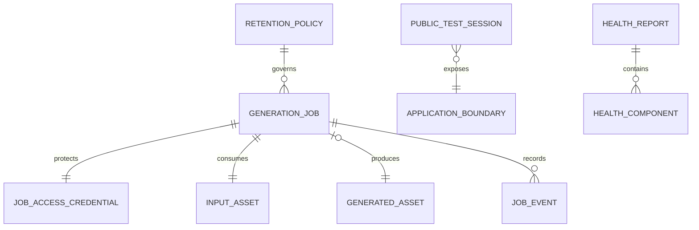

# Data Model: Single-Node AI Generation with Secure Public Test Access

**Source of truth**: One SQLite database and one contained filesystem storage
root owned by a single FastAPI process on the Notebook. ComfyUI is an execution
dependency, not the authoritative job store. Public Test Session and Health
Report are runtime/operator views and do not require new persistent services.

## Relationship overview



`APPLICATION_BOUNDARY` is the single Caddy origin at `127.0.0.1:8080`; it is a
design boundary, not a database table.

## Generation Job

One durably accepted generation attempt.

| Field | Type | Rules |
|---|---|---|
| `id` | UUID text | Opaque server-generated UUIDv4; primary key and safe directory key |
| `token_digest` | digest | SHA-256 digest of a 256-bit token; raw token is never persisted |
| `status` | internal enum | Stored compatibility values may include `processing`; API serialization maps it to public `running` |
| `progress_percent` | integer nullable | 0-100 only when backed by engine evidence; otherwise null |
| `progress_message` | safe string nullable | Allowlisted user-facing meaning; no engine payload/path/identifier |
| `engine_job_id` | string nullable | Private ComfyUI prompt handle; never exposed publicly |
| `workflow_revision` | string | Actual pinned workflow-manifest revision used by the job |
| `input_asset_id` | UUID | Exactly one same-job input asset |
| `output_asset_id` | UUID nullable | Exactly one same-job finalized GLB when available |
| `error_code` | safe string nullable | Stable application code such as `generation_timeout` or `restart_recovery` |
| `error_message` | safe string nullable | Understandable message with no secret, path, trace, or engine identifier |
| `attempt_count` | integer | Starts at zero; the first engine-submission reservation changes it atomically |
| `created_at` | UTC timestamp | Server generated |
| `queued_at` | UTC timestamp | Durable FIFO ordering key |
| `started_at` | UTC timestamp nullable | Set on internal processing/public running transition |
| `finished_at` | UTC timestamp nullable | Set on terminal transition |
| `expires_at` | UTC timestamp | `created_at + 24 hours` |
| `updated_at` | UTC timestamp | Updated in the same transaction as state changes |

Invariants:

- Job admission, input-asset record, token digest, and accepted event commit
  before a `201` response.
- Exactly one raw token is returned at creation; it grants access to only this
  job and is never recoverable from storage.
- All asset references belong to the same job.
- At most one job is publicly `running` at a time.
- `completed` is entered only after one GLB is validated and atomically
  published. A previously completed job whose file later disappears remains an
  immutable historical terminal record, but result URLs are suppressed, an
  `output_missing` event is added, and reads return a safe unavailable result.
- Terminal states are immutable.
- Queue position is derived at read time from durable FIFO order; it is nullable
  and labelled approximate unless exact ordering can be guaranteed.
- Existing persisted `processing` is private compatibility data. New public
  contracts contain no sixth state.

## Public job state machine

```text
queued ─────────> running ─────────> completed
  │                 │  └──────────> failed
  │                 └─────────────> cancelled
  ├───────────────────────────────> failed
  └───────────────────────────────> cancelled
```

| Current | Allowed next | Trigger and durable requirement |
|---|---|---|
| `queued` | `running` | One worker owns the GPU slot and the one-attempt engine reservation is persisted before submission |
| `queued` | `failed` | Missing/corrupt input, unavailable required dependency after admission, or unrecoverable reserved state |
| `queued` | `cancelled` | A supported cancellation is durably recorded before engine submission |
| `running` | `completed` | Exactly one valid textured GLB is atomically published and linked |
| `running` | `failed` | Engine failure, configured timeout, invalid/missing output, GPU/resource failure, or restart recovery |
| `running` | `cancelled` | Engine cancellation is confirmed or an approved operator cancellation is recorded |
| any terminal | none | Terminal state and completion timestamp are stable |

Progress does not create a state. It can remain null and must not claim a
percentage, duration, or queue position the engine cannot support accurately.

## Job Access Credential

The credential is a capability for one job.

| Field | Type | Rules |
|---|---|---|
| `raw_token` | URL-safe random bytes | 256 bits; returned once in the creation body; held by the client, not stored |
| `token_digest` | SHA-256 digest | Stored on the job; compared in constant time |
| `job_id` | UUID | One-to-one association |
| `expires_at` | UTC timestamp | Same effective access boundary as job retention |

It is sent only in `X-Job-Token`. Missing, invalid, expired, or cross-job
credentials all produce the same `404` response and expose no job metadata.

## Input Asset

Exactly one validated JPEG or PNG per accepted job.

| Field | Type | Rules |
|---|---|---|
| `id` | UUID text | Server generated |
| `job_id` | UUID text | Foreign key to exactly one job |
| `kind` | enum | `input` |
| `relative_path` | relative path | Server generated under `uploads/<job_id>/`; never derived from a user path |
| `content_type` | enum | Verified `image/jpeg` or `image/png` |
| `size_bytes` | integer | 1 through 10,485,760 bytes |
| `sha256` | hex digest | Computed from the accepted content |
| `created_at` | UTC timestamp | Server generated |
| `expires_at` | UTC timestamp | No later than job expiry |

Validation requires a safe single-component filename, bounded read, matching
extension/MIME/decoded content, successful image verification and decode, and a
resolved destination inside the storage root. The original filename is not
used for the stored path.

## Generated Asset

At most one public asset per job.

| Field | Type | Rules |
|---|---|---|
| `id` | UUID text | Server generated |
| `job_id` | UUID text | One-to-one with a completed job |
| `kind` | enum | `output` |
| `relative_path` | relative path | Exactly `outputs/<job_id>/model.glb` in application storage |
| `content_type` | constant | `model/gltf-binary` |
| `size_bytes` | positive integer | Measured after finalization |
| `sha256` | hex digest | Integrity/evidence value |
| `validated_at` | UTC timestamp | After GLB structure/material/texture validation |
| `created_at` | UTC timestamp | Server generated |
| `expires_at` | UTC timestamp | No later than job expiry |

ComfyUI writes only private intermediate output beneath its configured
`jobs/<job_id>` output namespace. The application accepts exactly one non-empty
candidate, validates it, writes a same-volume temporary file, and atomically
renames it to the public application location. No partial/intermediate file is
served.

## Job Event

An append-only, time-ordered diagnosis and recovery record.

| Field | Type | Rules |
|---|---|---|
| `id` | integer | Monotonic database primary key |
| `job_id` | UUID text | Foreign key |
| `sequence` | integer | Unique and increasing within a job |
| `event_type` | enum/string | `accepted`, `state_changed`, `progress`, `reconciled`, `output_missing`, `downloaded`, or `cleanup` |
| `from_status` | internal enum nullable | Present for state transitions |
| `to_status` | internal enum nullable | Present for state transitions |
| `progress_percent` | integer nullable | Evidence-backed only |
| `safe_message` | string nullable | Sanitized context only |
| `created_at` | UTC timestamp | Server generated |

Events may include safe Job ID, transition, workflow revision, attempt count,
and failure category. They never contain raw tokens, original user content,
private paths, engine payloads, temporary public URLs, or generated bytes.

## Public Test Session

One operator-controlled period of temporary public exposure. It is runtime-only
metadata and is not committed to Git or stored in the job database.

| Field | Type | Rules |
|---|---|---|
| `session_id` | random local identifier | For operator correlation only; not a public authorization credential |
| `endpoint` | HTTPS URL | Cloudflare-assigned `*.trycloudflare.com`; displayed as temporary non-production |
| `origin` | constant | `http://127.0.0.1:8080` |
| `connector_pid` | process ID | Local operator view only |
| `started_at` | UTC timestamp | Set after URL assignment and local readiness |
| `ended_at` | UTC timestamp nullable | Set when connector stops |
| `status` | enum | `starting`, `ready`, `interrupted`, `stopped` |

Invariants:

- At most one advertised test endpoint is current.
- A URL change creates a new session; it never updates application data.
- The endpoint is public and must never be treated as authentication.
- The endpoint is excluded from source control, durable application logs, and
  sanitized evidence unless irreversibly redacted.
- Stopping the session leaves Caddy, the local app, SQLite, and job files
  intact.

## Health Report

An operator-local point-in-time view assembled from independent checks. It is
not a detailed public API response and need not be stored in SQLite.

| Field | Type | Rules |
|---|---|---|
| `checked_at` | UTC timestamp | Operator host time |
| `overall` | enum | `ready`, `degraded`, `unavailable` |
| `components` | list | One result for Caddy, web, API, storage, workflow, ComfyUI, GPU, and Quick Tunnel |
| `component.status` | enum | `ready`, `degraded`, `unavailable`, `not_started` |
| `component.latency_ms` | integer nullable | Local/public probe duration where safe |
| `component.safe_reason` | allowlisted string nullable | No internal trace, secret, content, or private path |
| `request_id` | UUID nullable | Correlates safe probe logs |

`overall=ready` requires all local generation layers to be ready. A stopped
Quick Tunnel makes public-route readiness unavailable but does not make the
local generation application unusable; the report distinguishes those scopes.

## Retention Policy

The policy is configuration plus enforced behavior, not a separate database
service.

| Setting | Approved value | Behavior |
|---|---|---|
| `retention_hours` | 24 | Files are inaccessible at expiry and automatically removed |
| `min_free_disk_percent` | 10 | New admission returns `507`; accepted work may continue |
| `max_upload_bytes` | 10,485,760 | Application limit after multipart framing |
| `caddy_request_guard` | 12 MB | Outer streaming guard, not the business limit |
| `max_pending_jobs` | 20 | Atomic admission bound for queued/running work |
| `max_active_gpu_jobs` | 1 | Fixed until approved measured evidence changes it |
| `submissions_per_minute` | 30 | Durable public abuse/capacity bound |
| `identical_inputs_per_minute` | 5 | Hash-based duplicate pressure bound |
| `job_timeout_seconds` | 600 default | Validated configurable bound; timeout becomes safe failure |

Startup and periodic maintenance delete expired terminal data. They also scan
only safe UUID job directories for abandoned content with no matching database
row and delete it after a documented grace period. Cleanup proves containment,
does not follow links, skips non-terminal jobs, and records sanitized outcomes.

## Restart reconciliation

| Persisted condition | Required result |
|---|---|
| Queued, valid input, `attempt_count=0` | Rehydrate in `queued_at,id` FIFO order |
| Queued but engine reservation already taken | Fail `restart_recovery`; never submit again automatically |
| Running/internal processing | Fail `restart_recovery` unless an exact, tested engine-handle reattachment succeeds; default is fail-safe |
| Possible matching ComfyUI work after API restart | Report to operator and interrupt/quarantine; never publish through another job |
| Completed with valid published GLB | Remain completed and serve authorized result |
| Completed with missing/invalid published GLB | Remain immutable, add `output_missing`, suppress URLs, return safe unavailable result, and degrade storage health |
| Failed/cancelled | Remain terminal |
| Expired terminal | Make inaccessible, then remove files and row/event data according to policy |
| Orphan UUID directory with no job row | Remove after grace period and record a sanitized cleanup result |

This policy prefers an explicit safe failure over duplicate execution or false
completion. The operator can diagnose private engine leftovers, but no recovery
path may attach an output to a different Job ID.
