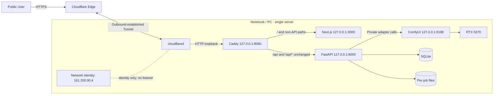
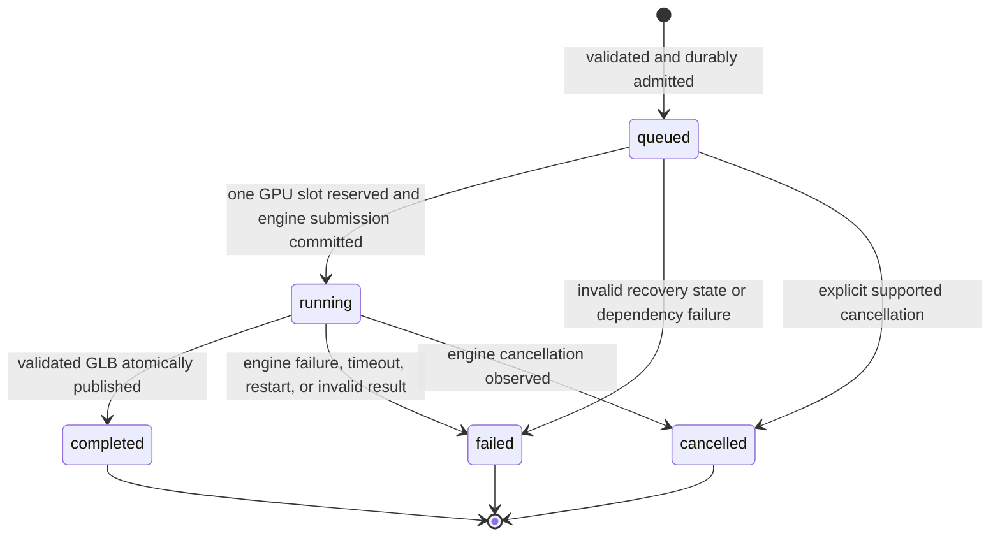

# Implementation Plan: Single-Node AI Generation with Secure Public Test Access

**Branch**: `main` (feature directory `004-secure-ai-test-access`) | **Date**:
2026-09-06 | **Spec**: [spec.md](./spec.md)

**Input**: Approved feature specification at
`specs/004-secure-ai-test-access/spec.md`

## Summary

Preserve the repository's existing Next.js, FastAPI, SQLite, ComfyUI, Caddy,
WinSW, and RTX 5070 implementation and replace only the obsolete public-entry
assumptions. The one Windows Notebook is the complete server. During a test
session, `cloudflared` creates an outbound Quick Tunnel to Caddy at
`http://127.0.0.1:8080`; Caddy preserves `/api/*` and sends it directly to
FastAPI at `127.0.0.1:8000`, sends all other paths to Next.js at
`127.0.0.1:3000`, and FastAPI alone calls ComfyUI at `127.0.0.1:8188`.

The public contract continues to use an opaque Job ID and one-time per-job
capability token. SQLite remains the durable source of truth, one in-process
worker remains the only GPU dispatcher, and browser progress remains bounded
HTTP polling. The public state required by this feature is `running`; the
existing persisted `processing` value remains an internal compatibility detail
and is mapped at the API boundary. No domain, DNS record, inbound application
listener, second server, external queue, or cloud compute resource is added.

## Technical Context

**Language/Version**: Python 3.12.10 (`>=3.12,<3.13`); TypeScript 5.9.3 on
Node.js 24 (`>=24,<25`) and npm 11; PowerShell 5.1+ for Windows operations;
Caddyfile syntax for Caddy 2.11.4; cloudflared 2026.8.3 observed on the target
Notebook

**Primary Dependencies**: FastAPI 0.116.1, Uvicorn 0.35.0, Pydantic 2.11.7,
aiosqlite 0.21.0, httpx 0.28.1, Pillow 11.3.0, Next.js 16.3.4, React 19.2.8,
Three.js 0.185.1, React Three Fiber/Drei, ComfyUI 0.34.0 with the pinned
Hunyuan3D workflow, Caddy, cloudflared, and WinSW v2

**Storage**: One local SQLite database plus per-job upload, work, output, and
quarantine directories on the Notebook; ComfyUI output remains private until a
validated GLB is atomically published into application storage

**Testing**: pytest 8.4.1 and pytest-asyncio 1.1.0; Ruff 0.12.10 and mypy
1.17.1; Vitest 4.1.11, Testing Library, Playwright 1.62.1, ESLint and TypeScript
typecheck; Caddy validation; PowerShell service/health checks; controlled real
ComfyUI/GPU runs; and external-network Quick Tunnel acceptance checks

**Target Platform**: The single project-owned Windows Notebook/PC whose
assigned lab-network interface address is `161.200.90.4`, with one NVIDIA RTX
5070 Laptop GPU (8 GB observed). Every application listener binds to loopback;
the assigned address is deployment identity, not ingress.

**Project Type**: Monorepo web application with a local API service, local AI
workflow process, reverse proxy, and Windows operational tooling

**Performance Goals**: Return accepted Job ID/token within three seconds after
upload transfer; restore durable status within ten seconds after browser
reconnect; show the usable public page and test notice within five seconds for
at least 95% of measured test loads; expose accurate component health within
five minutes of Notebook network readiness and identify a forced failing layer
within two minutes; complete or safely fail every admitted job within the
configured generation timeout

**Constraints**: One server and one active GPU job; loopback ports 3000, 8000,
8080, and 8188; outbound-only Tunnel connectivity; Quick Tunnel is temporary,
has no SLA, allows at most 200 concurrent in-flight requests, and does not
support SSE; JPEG/PNG input is at most 10 MiB; Caddy applies a 12 MB multipart
guard without request buffering; job data expires after 24 hours; new admission
stops below 10% free disk; the Quick Tunnel URL is public runtime data, not an
authentication secret

**Scale/Scope**: One Notebook, one GPU worker, one FastAPI process, one SQLite
database, one temporary public test session at a time, at most 20 admitted
non-terminal jobs, 30 submissions per minute, five identical inputs per minute,
and five concurrent users in the required acceptance scenario

## Constitution Check

*GATE: Passed before Phase 0 research and passed again after Phase 1 design.*

| Principle | Pre-research evaluation | Post-design evidence | Result |
|---|---|---|---|
| I. Single-Node Architecture | Existing app and AI processes already run on the Notebook; obsolete feature-003 split-host material must not remain active. | The component map, local routing contract, data model, and quickstart contain one node only. | PASS |
| II. Outbound-Only Public Connectivity | Quick Tunnel requires an outbound connector and no inbound application port. | Routing and validation require outbound TCP/UDP 7844 and negative direct-listener checks for 3000/8000/8080/8188. | PASS |
| III. Local Service Isolation | Required origins and upstreams are all loopback; Caddy is the sole Tunnel origin. | [local-routing.md](./contracts/local-routing.md) fixes listener ownership and preserves the `/api` prefix. | PASS |
| IV. Environment Separation | Only a temporary Quick Tunnel is authorized. | [quickstart.md](./quickstart.md) uses a disposable `trycloudflare.com` URL, rejects default named-tunnel config, and performs no DNS action. | PASS |
| V. Security and Secrets | Existing per-job tokens, content validation, path containment, and redaction are compatible. | API and routing contracts keep job credentials out of URLs/logs and treat the temporary URL as public. | PASS |
| VI. Reliability and Resource Control | SQLite, serial dispatch, 10 MiB input, 24-hour retention, and disk admission bounds already exist. | [data-model.md](./data-model.md) defines external states, recovery, timeouts, orphan handling, and single-GPU invariants. | PASS |
| VII. Testing and Observability | Existing suites cover the core job flow but old Caddy/WireGuard evidence is incompatible. | The validation matrix below and [operator-health.md](./contracts/operator-health.md) define updated automated and target-environment evidence. | PASS |
| VIII. Scope Control | Framework migration, a second server, named Tunnel, custom domain, and direct ingress are unnecessary. | All design artifacts stay within the approved feature; future custom-hostname work is documentation only. | PASS |

There are no constitutional violations or exceptions to justify. Any later
proposal for a second node, public binding, external state service, stable
hostname, DNS change, alternate Tunnel origin, or changed trust boundary stops
implementation until its spec, plan, approval, and evidence are updated.

## System Design



### Component boundaries

| Component | Owns | Must not own |
|---|---|---|
| Browser/Next.js | Input UX, temporary-test notice, token held in browser state, polling, preview, download | Direct ComfyUI calls, engine identifiers, custom-domain assumptions |
| Cloudflare Quick Tunnel | Temporary public HTTPS entry and outbound transport to one loopback origin | Authentication, stable identity, DNS, job state, production availability |
| Caddy | Loopback entry, exact route split, correlation header, safe proxy failures, security headers, bounded logs | AI readiness gating on every request, job authorization, persistence, body spooling |
| FastAPI | Validation, admission, job/token authorization, durable state, queue ownership, safe errors, artifact publication | Public binding, multiple worker processes, public ComfyUI details |
| ComfyUI adapter | Allowlisted workflow mapping, bounded engine calls, private engine-state translation, GLB location resolution | Public routes, public state vocabulary, durable job authority |
| SQLite/filesystem | Durable job/event/asset state and isolated content | Raw tokens, public URLs, arbitrary user-controlled paths |
| Operator tooling | Ordered lifecycle, layered health, temporary URL display, target-network evidence | Domain/DNS mutation, secret logging, hidden architecture changes |

### Routing and trust decisions

- Caddy uses a host-agnostic `:8080` site address with `bind 127.0.0.1` so the
  public `Host` forwarded by Cloudflare is accepted without exposing the
  listener beyond loopback.
- The API matcher covers exact `/api` and `/api/*` and uses `handle`, never
  `handle_path`; FastAPI therefore receives `/api/v1/...` unchanged.
- The existing Next.js rewrite remains a direct-local-development convenience
  only. Caddy, not Next.js, is authoritative for the Tunnel path.
- Caddy does not preflight the AI engine before every request. The page must
  remain usable when ComfyUI is down, while FastAPI returns a safe `503` for
  new admission and its health endpoints distinguish API and engine readiness.
- Public requests never reach ComfyUI WebSocket or REST routes. Public progress
  uses HTTP status polling with the existing 2/5/10-second backoff; any local
  ComfyUI WebSocket remains an adapter implementation detail.

## API and Job Lifecycle Design

The external contract is [openapi.yaml](./contracts/openapi.yaml). Job creation
validates and durably commits the job, input asset, token digest, and accepted
event before returning `201`. GPU execution starts asynchronously, so public
upload requests never remain open for the generation duration.



The public API emits only the five states above. Existing domain and SQLite
rows may continue to store `processing` for compatibility, but one explicit
serializer maps it to public `running`; browser types, UI labels, OpenAPI, and
public tests use `running`. ComfyUI state names never cross the adapter.

Job status reads return persisted state quickly. Engine inspection and retrying
network calls stay in the background worker so a stalled ComfyUI request cannot
block the FastAPI event loop or violate reconnect responsiveness. Existing
blocking adapter calls run via a worker thread (or an equivalent deliberately
async adapter revision), and adapter shutdown is awaited after dispatch stops.

Each accepted job has one durable engine-submission reservation. Retrying a
single internal submission cannot enqueue it twice. Repeating a browser upload
after a lost response may create a second job; that is intentionally defined as
a separate isolated attempt, not request-level deduplication. Rate and queue
bounds limit abuse, and neither attempt may overwrite or reveal the other.

The public cancellation operation requires the same per-job credential as
status and result access. It removes only a still-waiting job from the local
dispatcher, records `cancelled` in SQLite before returning, and is idempotent.
The browser keeps the credential in per-tab session storage, so refresh does
not remove the owner's cancel control. Once engine submission is reserved, the
public operation returns a safe conflict instead of interrupting ComfyUI.

## ComfyUI, Files, and Resource Control

The internal adapter contract is
[comfyui-adapter.md](./contracts/comfyui-adapter.md). It keeps the existing
pinned Hunyuan workflow and allowlisted input/output mapping. Real jobs record
the actual workflow-manifest revision rather than the mock fixture revision.

- The default generation timeout remains 600 seconds but becomes a validated
  setting. A target-GPU baseline may justify an approved value change; it does
  not create a public runtime SLA.
- ComfyUI HTTP operations retain bounded connection/response timeouts and
  limited retry for idempotent status reads. Submission is guarded durably and
  is never automatically replayed when its outcome is uncertain.
- Exactly one job owns the RTX 5070 execution slot. The pinned workflow, 10 MiB
  input limit, 20-job pending cap, storage threshold, and timeout are the MVP
  GPU/disk protection controls. Higher concurrency requires measured evidence
  and architecture approval.
- Uploads are read with a hard byte bound, content-decoded as JPEG/PNG, hashed,
  and written under a server-generated UUID directory. Caddy streams multipart
  bodies and uses a 12 MB framing guard; FastAPI's 10 MiB file limit remains
  authoritative.
- Comfy output is resolved only under `jobs/<job_id>`, validated as one complete
  textured GLB, and atomically renamed to `outputs/<job_id>/model.glb`. Preview
  and download serve only that published file with `private, no-store`.
- Startup and maintenance remove expired terminal content and abandoned UUID
  directories older than a documented grace period when no matching job row
  exists. Cleanup never follows links or crosses the configured storage root.

## Recovery and Lifecycle Operations

WinSW remains the process supervisor for ComfyUI, FastAPI, and Next.js. Caddy is
added as the `Local3D-Caddy` WinSW service with its loopback-only configuration.
The Quick Tunnel is deliberately an operator-started test-session process: it
is started only after local health passes, prints a newly assigned URL, and is
stopped before local services. It is not installed as an unattended named
Tunnel service because its URL is disposable and this feature has no custom
hostname authorization.

Startup order is ComfyUI, FastAPI, Next.js, Caddy, local layered health, and
then Quick Tunnel. Shutdown order is Quick Tunnel, Caddy, Next.js, FastAPI, and
ComfyUI. FastAPI stops new admission, stops/drains its worker within a bounded
grace period, closes the adapter client/thread, and closes SQLite cleanly. If a
hard stop interrupts execution, restart reconciliation is authoritative:

- a queued job with no engine-submission reservation is returned to FIFO order;
- a reserved or running job is failed with `restart_recovery` unless tested
  engine reattachment proves its exact handle, and it is never resubmitted
  automatically;
- possible orphan ComfyUI work is identified and interrupted or quarantined by
  the operator without converting it into a second public result;
- a completed row is served only if its published GLB still validates; a
  missing file creates an `output_missing` event, suppresses result URLs, and
  returns a safe unavailable result without mutating an immutable terminal
  history;
- the local app remains usable when the Quick Tunnel is absent, and a new
  Tunnel session never migrates application data.

## Configuration, Security, and Observability

Committed examples contain non-secret defaults only. Runtime settings cover
storage root, SQLite path, mock/real adapter choice, loopback ComfyUI URL,
upload/queue/rate/disk/retention bounds, job timeout, log paths, and Caddy
upstreams. The Quick Tunnel needs no token, credentials file, hostname, ingress
configuration, or DNS record. A preflight fails with guidance if the default
Cloudflare config directory already contains `config.yaml` or `config.yml`;
operator-owned files are never renamed automatically.

Caddy and application logs use bounded rotation and retain request ID, safe Job
ID, route class, status, duration, state transition, and dependency result.
They remove `X-Job-Token`, authorization and cookie headers, query values,
request/response bodies, user filenames/content, generated bytes, engine IDs,
private paths, and the temporary public URL. `cloudflared` remains at `info` or
safer; debug logging is prohibited during user traffic because it may include
request headers.

All application listeners are verified as loopback. The network request is
outbound TCP and UDP 7844 so cloudflared can select QUIC and fall back to
HTTP/2. No inbound NAT, firewall allow rule, portproxy, or listener is created
for `161.200.90.4`. Legacy LAN portproxy/WireGuard material is not part of this
feature and must not be used as evidence for it.

## Validation Strategy

The baseline inspected before planning was green: API `247 passed, 5 skipped`;
web unit tests `8 passed`; web typecheck and lint passed. Implementation
validation extends those suites without accepting obsolete feature-003
WireGuard, `:8443`, or named-Tunnel assertions.

| Layer | Required evidence |
|---|---|
| Static quality | Ruff, mypy, ESLint, TypeScript typecheck, production web build, YAML/OpenAPI parse, Caddy format/validate |
| API contract | Upload validation and `201/413/415/422/429/503/507`; public `running`; uniform `404`; authorized preview/download; safe missing-result behavior |
| Job/recovery | FIFO with one active job, multi-user isolation, background observation, timeout, durable reservation, queued rehydration, running restart failure, orphan cleanup, no partial GLB |
| Routing | `/` reaches Next.js; exact `/api` and `/api/*` reach FastAPI without prefix stripping; other routes do not leak internal ports; Caddy failures are safe and no-store |
| Health | Independent web, API, storage, workflow, ComfyUI, GPU, Caddy, and Quick Tunnel checks as defined in [operator-health.md](./contracts/operator-health.md) |
| Public transport | Valid near-limit upload, 2/5/10-second polling, preview/download, non-JSON edge `429`, Tunnel interruption/restart, and changed URL through the Quick Tunnel |
| Security | Listener inventory shows only loopback on 3000/8000/8080/8188; authorized external probes obtain no application response; token/content sentinel scan returns zero findings |
| Hardware | Pinned workflow and model manifest verification plus one real RTX 5070 generation, captured as sanitized target-environment evidence |
| Restart | Three controlled Notebook restart trials satisfy SC-009 and reconcile every accepted job without duplicate submission or false completion |

Before any Next.js source change, implementation must read the relevant local
guidance under `apps/web/node_modules/next/dist/docs/`, as required by
`apps/web/AGENTS.md`.

## Project Structure

### Documentation (this feature)

```text
specs/004-secure-ai-test-access/
├── plan.md
├── research.md
├── data-model.md
├── quickstart.md
├── contracts/
│   ├── openapi.yaml
│   ├── local-routing.md
│   ├── comfyui-adapter.md
│   └── operator-health.md
└── tasks.md                 # Created later by $speckit-tasks, not this plan
```

### Source Code (repository root)

```text
apps/
├── api/
│   ├── src/local3d/
│   │   ├── adapters/generation/
│   │   ├── api/
│   │   ├── domain/
│   │   ├── persistence/
│   │   ├── services/
│   │   └── storage/
│   └── tests/{contract,integration,security,unit}/
└── web/
    ├── app/
    ├── components/
    ├── lib/{api,jobs}/
    └── tests/{e2e,unit}/

deploy/
├── caddy/
├── cloudflared/
└── windows/services/

scripts/
├── verify/
└── windows/

workflows/hunyuan3d/
storage/                      # Runtime-only, ignored
evidence/                     # Sanitized validation metadata only
```

**Structure Decision**: Keep the established web/API monorepo and operational
directories. Application behavior changes remain within `apps/api` and
`apps/web`; public-entry changes remain within `deploy` and `scripts`; the
pinned AI workflow remains under `workflows`. Historical feature-002/003 design
artifacts may remain as history, but their split-host, WireGuard, inbound, named
Tunnel, `:8443`, or custom-domain instructions are not active implementation
authority for feature 004.
