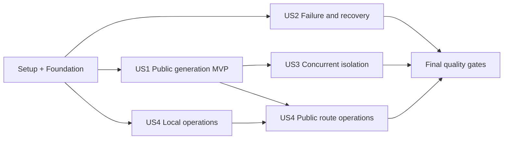

---

description: "Dependency-ordered implementation tasks for the single-node secure public AI test service"
---

# Tasks: Single-Node AI Generation with Secure Public Test Access

**Input**: Design documents from `specs/004-secure-ai-test-access/`

**Prerequisites**: `plan.md`, `spec.md`, `research.md`, `data-model.md`,
`contracts/`, `quickstart.md`, and Constitution 2.0.0

**Tests**: Automated contract, integration, security, unit, browser, and
operational tests are mandatory because the specification and constitution
require testable API, routing, failure, recovery, isolation, and observability
behavior. Within each story, test tasks precede their implementation where the
repository boundary permits it.

**Organization**: Tasks are grouped by independently testable user story. Every
task names its exact repository-relative target path. Historical feature-002
and feature-003 files may be retained as history, but no task may create a
second server, direct inbound application route, production hostname, domain
purchase, or unauthorized DNS change.

## Format: `[ID] [P?] [Story] Description`

- **[P]**: Safe to run in parallel after the phase's stated prerequisites
  because the task uses different files and does not depend on another
  incomplete parallel task.
- **[Story]**: User story traceability label; Setup, Foundational, and Final
  tasks intentionally have no story label.
- A test-first task must be committed or otherwise shown to fail for the
  intended missing behavior before its paired implementation task starts.

## Phase 1: Setup and Baseline

**Purpose**: Establish the compatible toolchain, safe configuration examples,
and a sanitized baseline before behavior changes.

- [X] T001 Run the existing API, web, contract, and Caddy baseline commands from `specs/004-secure-ai-test-access/quickstart.md`, record versions, pass/fail counts, current loopback listeners, known feature-003 incompatibilities, and the pre-existing dirty-worktree paths without copying secrets or temporary URLs into `evidence/feature-004/baseline.md`
- [X] T002 [P] Add `websockets` as an explicit pinned runtime dependency instead of relying on Uvicorn's transitive installation in `apps/api/pyproject.toml` and regenerate `apps/api/uv.lock`
- [X] T003 [P] Add only the approved single-node defaults and bounded settings (`127.0.0.1` ports, 600-second job timeout, worker/maintenance intervals, orphan grace, 10 MiB upload, 24-hour retention, 10% disk floor, queue/rate bounds, relative browser API base) to `apps/api/.env.example`, `apps/web/.env.example`, and `deploy/caddy/.env.example`, removing the active WireGuard upstream and any custom-hostname/token input
- [X] T004 [P] Mark named-tunnel/custom-DNS configuration as historical and document that feature 004 uses no config file or credentials by updating `deploy/cloudflared/README.md`, `deploy/cloudflared/config.yml.example`, and `deploy/cloudflared/services/README.md` and adding the runtime-only Quick Tunnel guidance to `deploy/cloudflared/quick-tunnel.md`

**Checkpoint**: Dependencies resolve, examples contain no secret or production
hostname, and the baseline is reproducible.

---

## Phase 2: Foundational Single-Node Boundary

**Purpose**: Establish the loopback routing, safe settings, SQLite runtime
policy, and supervised local processes that block every user story.

**Critical gate**: No story implementation starts until T016 passes.

### Tests for the foundation

- [X] T005 [P] Rewrite the static Caddy contract tests to require `:8080` plus `bind 127.0.0.1`, exact `/api` and `/api/*` matching with prefix preservation, frontend fallback to 3000, API upstream 8000, no 8188 route, 12 MB streaming guard, no buffering, no engine preflight, safe headers, and access/error-log token redaction in `tests/security/test_caddy_contract.py`
- [X] T006 [P] Rewrite the real local Caddy runtime test with independent mock web/API upstreams to prove public-style Host acceptance, unmodified API paths and bodies, web fallback, safe web/API upstream failures, generated request IDs, no-store responses, and zero sentinel leakage in `tests/security/test_caddy_runtime.py`
- [X] T007 [P] Add a static feature-004 architecture test that rejects active public/LAN binds, port 8443, WireGuard upstreams, named-tunnel credentials, custom hostnames, DNS mutation, and a second server while requiring loopback ports 3000/8000/8080/8188 in `tests/security/test_single_node_architecture_contract.py`
- [X] T008 [P] Add failing settings and SQLite tests for validated job timeout/worker/orphan bounds, forbidden secret-like environment names, loopback-only ComfyUI/API configuration, and the documented allow/deny/fallback journal-mode policy instead of the current `>=3.22` shortcut in `apps/api/tests/unit/test_settings.py` and `apps/api/tests/unit/test_database.py`
- [X] T009 [P] Add static WinSW tests for ComfyUI → API → Web → Caddy dependency order, loopback bindings, one API process, least-privilege service accounts, bounded restart policy, and absence of an automatic cloudflared/named-Tunnel service in `tests/security/test_single_node_services_contract.py`

### Foundation implementation

- [X] T010 [P] Implement and validate the approved timeout/worker/maintenance/orphan settings and safe SQLite journal selection in `apps/api/src/local3d/config.py` and `apps/api/src/local3d/persistence/database.py` until T008 passes
- [X] T011 [P] Replace the feature-003 pass-through with the exact Caddy 8080 split router, safe API/web failure responses, 12 MB unbuffered guard, request-ID overwrite, no-store/security headers, bounded rotation, and credential/content redaction in `deploy/caddy/Caddyfile` until T005-T006 pass
- [X] T012 [P] Update the Caddy web-upstream failure page so every rendered response clearly says temporary non-production test service and contains no internal host, port, path, stack, or production-uptime claim in `deploy/caddy/maintenance/maintenance.html`
- [X] T013 Add the `Local3D-Caddy` loopback WinSW definition with dependency on `Local3D-Web`, least-privilege runtime/log paths, and restart policy in `deploy/windows/services/caddy.xml`, then extend hash-verified installation and dependency-order handling in `scripts/windows/install_winsw_services.ps1`
- [X] T014 [P] Reconcile committed WinSW templates and installed copies to loopback-only single-node descriptions with no WireGuard/LAN dependency in `deploy/windows/services/comfyui.xml`, `deploy/windows/services/api.xml`, `deploy/windows/services/web.xml`, `deploy/windows/services/Local3D-ComfyUI.xml`, `deploy/windows/services/Local3D-API.xml`, `deploy/windows/services/Local3D-Web.xml`, and `deploy/windows/services/README.md`
- [X] T015 [P] Remove retired WireGuard assumptions from local process startup comments, keep API/web binds fixed to loopback, and document the Next.js rewrite as direct-local-development fallback rather than the Tunnel router in `scripts/windows/start_api_service.ps1`, `scripts/windows/start_web_service.ps1`, and `apps/web/next.config.ts`
- [X] T016 Run T005-T009 plus settings/database tests, Caddy format/validate/runtime checks, and the WinSW static contract; record exact commands and sanitized results with no temporary URL or token in `evidence/feature-004/foundation.md`

**Checkpoint**: Caddy is the only Tunnel-capable origin, every local service is
loopback-only, and the shared foundation is ready.

---

## Phase 3: User Story 1 - Generate and Retrieve a 3D Asset (Priority: P1) MVP

**Goal**: A public evaluator opens a temporary HTTPS page, sees the test notice,
submits one valid image, receives Job ID/token, observes truthful state, previews
one finalized textured GLB, and downloads the same bytes through the one
Notebook.

**Independent Test**: First complete a local mock and real-ComfyUI flow through
Caddy. Only after that passes, start a Quick Tunnel and repeat the entire flow
from an external network; verify `201`, authorized polling, `running`, one
validated GLB, preview controls, matching download integrity, and no direct
internal route.

### Tests for User Story 1

- [X] T017 [P] [US1] Add failing API/OpenAPI contract tests for `POST /api/v1/jobs`, authorized status/model/download, one-time Job Token, no-store headers, safe relative URLs, public `running` with no public `processing`, and uniform inaccessible-job `404` in `apps/api/tests/contract/test_jobs_api.py` and `apps/api/tests/contract/test_feature004_openapi.py`
- [X] T018 [P] [US1] Add failing real-adapter contract tests for manifest revision propagation, allowlisted mapping, private engine handles, bounded health, background-safe blocking calls, deterministic close, and exactly one contained GLB candidate in `apps/api/tests/contract/test_generation_adapter.py` and `apps/api/tests/contract/test_adapter_factory_readiness.py`
- [X] T019 [P] [US1] Extend the happy-path integration test to prove durable admission precedes `201`, status reads do not call a slow engine synchronously, one serial mock job reaches completion, and preview/download hashes match in `apps/api/tests/integration/test_job_lifecycle.py`
- [X] T020 [P] [US1] Add failing frontend unit tests for the non-production banner, JPEG/PNG submission, `running` display, truthful nullable progress/queue text, session restoration, authenticated model fetch, GLB download, and rotate/zoom/pan/reset controls in `apps/web/tests/unit/generation-flow.test.tsx`, `apps/web/tests/unit/job-status.test.tsx`, and `apps/web/tests/unit/model-viewer.test.tsx`
- [X] T021 [P] [US1] Extend the Playwright mock happy path to cover page load, test notice, accepted credentials, refresh recovery, public state vocabulary, preview, and download through same-origin `/api/v1` requests in `apps/web/tests/e2e/mock-happy-path.spec.ts`

### Implementation for User Story 1

- [X] T022 [US1] Implement the feature-004 public serializer and endpoint behavior, mapping internal `processing` to `running`, emitting result URLs only for a currently available finalized asset, preserving uniform token-protected `404`, and returning all job responses no-store in `apps/api/src/local3d/api/jobs.py`
- [X] T023 [P] [US1] Expose the verified real `workflow_revision` from the manifest mapper/factory and pass it into the real adapter instead of the mock fixture revision in `apps/api/src/local3d/adapters/generation/workflow_mapper.py` and `apps/api/src/local3d/adapters/generation/factory.py`
- [X] T024 [US1] Update job creation/rehydration to use the configured timeout and real workflow revision, move all submit/inspect waits off the FastAPI event loop, make `read_job` a fast persisted-state read, and retain exactly one durable engine-submission reservation in `apps/api/src/local3d/services/job_service.py`
- [X] T025 [US1] Add the managed adapter lifecycle contract, bounded real-client shutdown, private engine-handle logging behavior, and thread-safe close semantics in `apps/api/src/local3d/adapters/generation/base.py` and `apps/api/src/local3d/adapters/generation/comfy.py`
- [X] T026 [US1] Wire startup reconciliation, configured worker/maintenance cadence, one API worker, fail-closed real-adapter setup, and ordered worker/adapter/database shutdown into `apps/api/src/local3d/main.py`
- [X] T027 [P] [US1] Change the browser contract to public `running`, retain relative `/api/v1` calls and `X-Job-Token`, add bounded request cancellation shorter than the next poll, and preserve 2/5/10-second reconnect polling with safe non-JSON errors in `apps/web/lib/api/jobs.ts` and `apps/web/lib/jobs/use-job-status.ts`
- [X] T028 [US1] Add an always-visible temporary non-production notice, safe accepted-job credential persistence, supported-file guidance, and understandable accepted/queued/running text in `apps/web/app/page.tsx`, `apps/web/components/generation-form.tsx`, `apps/web/components/job-status.tsx`, and `apps/web/app/globals.css`
- [X] T029 [US1] Serve preview/download actions only when result URLs are present, fetch both with the Job Token, revoke object URLs, preserve matching GLB bytes, and keep rotate/zoom/pan/reset behavior accessible in `apps/web/components/generation-result.tsx` and `apps/web/components/model-viewer.tsx`
- [X] T030 [US1] Run the complete mock flow and one pinned real RTX 5070 flow through `http://127.0.0.1:8080`, including upload near the 10 MiB boundary, polling, preview/download hash equality, manifest validation, and listener inventory; record sanitized local evidence in `evidence/feature-004/us1-local.md`

### Quick Tunnel only after the local MVP gate

- [X] T031 [US1] Add failing static tests that require default `config.yaml`/`config.yml` preflight, exact origin `http://127.0.0.1:8080`, `info`-or-safer logging, temporary URL labelling, no credentials/DNS/service install, no output redirection, and redacted external evidence in `tests/security/test_quick_tunnel_contract.py`
- [X] T032 [P] [US1] Implement an operator-run Quick Tunnel launcher that refuses conflicting default configs, verifies local Caddy/web/API readiness, launches `cloudflared tunnel --url http://127.0.0.1:8080 --loglevel info`, displays the URL as temporary non-production, and stores no URL/token in the repository in `scripts/windows/start_quick_tunnel.ps1`
- [X] T033 [P] [US1] Adapt the external full-flow verifier to a random `trycloudflare.com` host, public `running`, polling/no SSE, non-JSON edge errors, current Job Token contract, matching GLB integrity, and automatic hostname/token redaction before evidence output in `scripts/verify/test_external_acceptance.py`
- [ ] T034 [US1] From an external network, run one end-to-end real AI generation through the current Quick Tunnel after T030, verify the page notice, `201` within three seconds after transfer, reconnect within ten seconds, finalized preview/download equality, and no ComfyUI identifiers; retain only redacted results in `evidence/feature-004/us1-public.md`

**Checkpoint — MVP complete**: One public user can complete one real AI-to-GLB
journey through Cloudflare, the outbound Tunnel, Caddy, FastAPI, ComfyUI, and the
RTX 5070 on the same Notebook.

---

## Phase 4: User Story 2 - Understand and Recover from Failure (Priority: P2)

**Goal**: Invalid input, unavailable dependencies, pressure, timeout,
cancellation, missing output, reconnect, and restart produce safe, accurate,
recoverable behavior with no partial result.

**Independent Test**: Induce every documented failure with mock dependencies,
refresh/reconnect during non-terminal states, restart the API with queued and
running work, and verify accurate durable state, safe error text, no duplicate
engine submission, no event-loop stall, no orphan content beyond grace, and no
incomplete GLB.

### Tests for User Story 2

- [X] T035 [P] [US2] Add failing contract tests for `413/415/422/429/503/507`, `Retry-After`, unavailable-adapter admission, timeout/cancellation/missing-result payloads, immutable terminal states, no-store, and the same `404` for missing/wrong/expired/cross-job credentials in `apps/api/tests/contract/test_job_status_and_failures.py`
- [X] T036 [P] [US2] Extend stalled-engine tests so submit/inspect timeouts and bounded retries never block liveness or persisted job reads beyond the ten-second reconnect target, and unknown observations fail only at the configured job timeout in `apps/api/tests/integration/test_status_poll_retry_state.py`
- [X] T037 [P] [US2] Extend restart tests for FIFO rehydration of unreserved queued jobs, fail-safe reserved/running recovery, zero blind resubmission, orphan ComfyUI handle reporting, and completed-output revalidation in `apps/api/tests/integration/test_adapter_recovery.py`
- [X] T038 [P] [US2] Add failing cleanup tests for expired terminal content, a crash-created UUID directory without a row, grace-period protection, link/path containment, cleanup/read overlap, and low disk while accepted work continues in `apps/api/tests/integration/test_orphan_cleanup.py` and `apps/api/tests/integration/test_submission_bounds.py`
- [X] T039 [P] [US2] Add failing health tests for process liveness, database/storage/adapter admission readiness, short engine reachability, safe degraded/unavailable bodies, and zero internal topology disclosure in `apps/api/tests/contract/test_health_and_errors.py`
- [X] T040 [P] [US2] Add failing structured-log tests using known token/content/path/engine-ID/temporary-URL sentinels while requiring request ID, safe Job ID, transition, duration, and failure category in `apps/api/tests/security/test_observability.py`
- [X] T041 [P] [US2] Add frontend unit and Playwright recovery tests for corrupt/oversized input, application and non-JSON edge `429`, `503`, `507`, timeout, cancellation, result unavailable, lost polling, refresh recovery, and actionable retry guidance in `apps/web/tests/unit/generation-flow.test.tsx` and `apps/web/tests/e2e/mock-recovery.spec.ts`

### Implementation for User Story 2

- [X] T042 [US2] Implement stable safe error mappings, `Retry-After`/no-store headers, controlled adapter-unavailable `503`, uniform inaccessible-job `404`, and `409` with zero bytes for non-finalized or unavailable results in `apps/api/src/local3d/api/jobs.py`, `apps/api/src/local3d/api/errors.py`, and `apps/api/src/local3d/api/dependencies.py`
- [X] T043 [US2] Implement background-only engine observation, bounded retry, configured generation timeout, safe cancellation/failure decisions, and a responsive worker loop that preserves the last durable state during transient engine loss in `apps/api/src/local3d/services/job_service.py` and `apps/api/src/local3d/services/generation_coordinator.py`
- [X] T044 [US2] Implement restart reconciliation that requeues only valid unreserved work, fails uncertain reserved/running work with `restart_recovery`, records possible orphan engine work for operator action, revalidates completed assets, and emits `output_missing` without false completion in `apps/api/src/local3d/services/recovery.py`
- [X] T045 [US2] Add contained orphan-directory enumeration/removal after the configured grace period, safe link/traversal rejection, atomic file behavior, and cleanup/read coordination in `apps/api/src/local3d/storage/job_storage.py` and `apps/api/src/local3d/services/job_service.py`
- [X] T046 [US2] Strengthen safe readiness to check initialized job service, SQLite/storage admission capability, verified workflow configuration, and short bounded engine health independently without exposing details in `apps/api/src/local3d/api/health.py` and `apps/api/src/local3d/main.py`
- [X] T047 [US2] Add structured request/job/state/failure logging with allowlisted fields and explicit redaction of tokens, headers, filenames, content, private paths, engine IDs, and temporary URLs in `apps/api/src/local3d/observability/logging.py`, `apps/api/src/local3d/main.py`, and `apps/api/src/local3d/services/job_service.py`
- [X] T048 [P] [US2] Map each application/edge failure to understandable user guidance, preserve the last durable state during reconnect, suppress preview/download when URLs are absent, and keep session-restored Job ID/token private in `apps/web/lib/api/jobs.ts`, `apps/web/components/generation-form.tsx`, `apps/web/components/job-status.tsx`, `apps/web/components/generation-result.tsx`, and `apps/web/app/page.tsx`
- [X] T049 [US2] Run the complete local failure matrix with mock and controlled real dependencies, including invalid input, pressure, low disk, hang/timeout, cancellation, missing/corrupt output, API/ComfyUI restart, and orphan cleanup; record sanitized expected/actual outcomes in `evidence/feature-004/us2-failures.md`

**Checkpoint**: Users can distinguish correctable input, temporary capacity,
dependency outage, terminal generation failure, and reconnect conditions
without receiving internal details or partial assets.

---

## Phase 5: User Story 3 - Keep Concurrent Users Isolated (Priority: P3)

**Goal**: Five simultaneous users remain isolated while no more than one job
owns the GPU; duplicates never overwrite or cross-link data.

**Independent Test**: Submit five distinct valid images while one job runs,
verify FIFO/one-active behavior and unique Job IDs/tokens/directories/assets,
then exercise missing, wrong, expired, guessed, and cross-job credentials plus a
lost-response duplicate retry.

### Tests for User Story 3

- [X] T050 [P] [US3] Extend concurrent integration coverage to five accepted users, exactly one internal processing/public running job, durable FIFO order, safe queue positions, and independent final assets in `apps/api/tests/integration/test_two_user_queue.py`
- [X] T051 [P] [US3] Extend security tests so guessed IDs and missing/wrong/expired/cross-job tokens reveal zero status, events, input, preview, output, or timing-distinguishable job existence in `apps/api/tests/security/test_job_isolation.py`
- [X] T052 [P] [US3] Add simultaneous admission and duplicate-upload tests for atomic pending/rate/identical-input bounds, one engine reservation per Job ID, distinct jobs after a lost creation response, and zero overwrite/cross-link in `apps/api/tests/integration/test_submission_bounds.py` and `apps/api/tests/integration/test_duplicate_safety.py`
- [X] T053 [P] [US3] Extend browser isolation tests with two independent sessions, cross-token requests, concurrent queue display, duplicate button activation, and distinct model/download bytes in `apps/web/tests/e2e/mock-isolation.spec.ts`

### Implementation for User Story 3

- [X] T054 [US3] Preserve atomic SQLite admission counts and `queued_at,id` FIFO selection across concurrent transactions, include internal `processing` in non-terminal capacity while serializing it publicly as `running`, and enforce one reserved submission in `apps/api/src/local3d/persistence/jobs.py` and `apps/api/src/local3d/services/serial_dispatcher.py`
- [X] T055 [P] [US3] Harden constant-time per-job capability checks, same-job asset ownership, contained UUID paths, and atomic input/output isolation until T051-T052 pass in `apps/api/src/local3d/services/job_tokens.py` and `apps/api/src/local3d/storage/job_storage.py`
- [X] T056 [P] [US3] Prevent double-click submission while a request is pending, replace browser state only after a complete `201`, and retain each session's accepted Job ID/token without placing credentials in URLs or UI logs in `apps/web/components/generation-form.tsx` and `apps/web/app/page.tsx`
- [X] T057 [US3] Run a five-user local concurrency trial and a controlled two-job real-GPU serial trial, prove one active job, distinct token/path/hash ownership, no overwrite, and correct queued work; record only sanitized findings in `evidence/feature-004/us3-isolation.md`

**Checkpoint**: Public test concurrency is bounded and each user's capability
grants access to exactly one isolated job.

---

## Phase 6: User Story 4 - Operate and Diagnose the Single-Node Service (Priority: P4)

**Goal**: The operator can install, start, stop, inspect, interrupt, and recover
the complete one-Notebook service and identify the failing layer without
exposing secrets or opening inbound access.

**Independent Test**: Perform ordered clean start/stop, force each H1-H11 health
failure, restart queued and running jobs, reboot the Notebook three times,
restart the Quick Tunnel three times, and pair local listener/firewall evidence
with authorized external probes to ports 3000/8000/8080/8188.

### Tests for User Story 4

- [X] T058 [P] [US4] Rewrite the health-chain static contract to require independent Caddy, web, API/job, storage, workflow, ComfyUI, GPU, Quick Tunnel, and public-route probes, safe JSON/human output, bounded timeouts, and no WireGuard-derived health in `tests/security/test_health_chain_contract.py`
- [X] T059 [P] [US4] Add static tests for exact ComfyUI → API → Web → Caddy → Quick Tunnel startup, reverse shutdown, local-before-public gating, default-config refusal, PID ownership, and no automatic named Tunnel in `tests/security/test_windows_operator_scripts_contract.py`
- [X] T060 [P] [US4] Rewrite origin-lockdown verifier tests to prohibit TCP application responses on 3000/8000/8080/8188 at `161.200.90.4`, remove the WireGuard exception, require explicit external-vantage authorization, and classify timeout as inconclusive rather than pass in `tests/security/test_origin_lockdown_contract.py`
- [X] T061 [P] [US4] Add static restart-runner tests for three trials, queued/running fixtures, bounded health recovery, sanitized per-job outcomes, and zero automatic uncertain resubmission in `tests/security/test_operator_recovery_contract.py`

### Implementation for User Story 4

- [X] T062 [US4] Replace the WireGuard-oriented health chain with H1-H11 independent checks, safe reason codes, JSON plus concise output, non-zero requested-scope exit status, bounded probes, and redaction in `scripts/windows/health_chain.ps1`
- [X] T063 [US4] Implement exact local start/stop ordering and safe partial-start rollback in `scripts/windows/start_single_node.ps1` and `scripts/windows/stop_single_node.ps1`, then convert `scripts/windows/install_single_host_entry.ps1` and `scripts/windows/install_single_host_entry_admin.cmd` into wrappers that install only ComfyUI/API/Web/Caddy and refuse Tunnel tokens, DNS, or port 8443
- [X] T064 [US4] Extend the Quick Tunnel launcher with operator-owned PID/session state outside the repository, add a matching idempotent stop command, and retire automatic WireGuard/Tunnel mutation from the old watchdog in `scripts/windows/start_quick_tunnel.ps1`, `scripts/windows/stop_quick_tunnel.ps1`, and `scripts/windows/watchdog_tunnel.ps1`
- [X] T065 [US4] Update service verification to check all four WinSW services, exact loopback listeners, Caddy route split, API/engine health, one API worker, service accounts, dependency order, and absence of cloudflared as an automatic project service in `scripts/windows/verify_services.ps1`
- [X] T066 [US4] Rewrite controlled application/Notebook recovery runners for queued and running cases, three reboot trials, five-minute readiness, orphan-engine reporting, and sanitized state evidence in `scripts/windows/run_recovery_matrix.ps1`, `scripts/windows/verify_reboot_recovery.ps1`, and `scripts/windows/check_reboot_probe.py`
- [X] T067 [P] [US4] Replace feature-003/WireGuard assumptions with the assigned-address TCP probe set 3000/8000/8080/8188, explicit off-network confirmation, fail-closed timeout classification, and local-evidence correlation in `scripts/verify/test_origin_lockdown.py` and `scripts/verify/test_external_ports.py`
- [X] T068 [P] [US4] Rewrite the English operator runbook around one Notebook, WinSW service order, Caddy 8080, Quick Tunnel session lifecycle, health H1-H11, failure diagnosis, recovery, log redaction, and no domain/DNS/inbound actions in `docs/operations/windows-ai-server-runbook.en.md`
- [X] T069 [US4] Translate and technically cross-check the same single-node procedure, commands, warnings, and recovery meanings for Thai operators in `docs/operations/windows-ai-server-runbook.th.md`
- [X] T070 [US4] Reconcile the single-host test-entry guide with exact loopback ports, default-config preflight, operator-run Quick Tunnel, disposable URL communication, polling limitations, clean shutdown, and future custom-hostname work as approval-gated documentation only in `docs/operations/single-host-tunnel-setup.md`
- [X] T071 [P] [US4] Mark conflicting split-host, WireGuard, inbound-edge, named-Tunnel, port-8443, and custom-DNS procedures as historical for feature 004 and link to the active single-node runbook in `docs/operations/tunnel-setup.md`, `docs/operations/public-cutover.md`, `docs/operations/cloudflare-setup.md`, `docs/operations/network-permission-request.md`, `deploy/firewall/README.md`, and `deploy/wireguard/origin-transport-boundary.md`
- [X] T072 [US4] Perform clean local install/start/health/forced-layer-failure/stop trials with no Quick Tunnel, verify each H2-H9 diagnosis within two minutes and local data preservation, and record sanitized evidence in `evidence/feature-004/us4-operations.md`
- [X] T073 [US4] Perform three controlled Notebook restart trials with queued and running jobs, obtain accurate local health within five minutes of network readiness, and record every pre-restart Job ID's safe outcome with no token or content in `evidence/feature-004/us4-restart.md`
- [ ] T074 [US4] Only after T072-T073 pass, cycle Quick Tunnel public access three times from an external network, verify each new URL without data migration, prove outbound TCP/UDP 7844 use, pair local listener/firewall evidence with authorized negative probes to `161.200.90.4` ports 3000/8000/8080/8188, and store redacted results in `evidence/feature-004/us4-public-boundary.md`

**Checkpoint**: The operator can recover and diagnose the single-node service;
the temporary public route is independently controllable and internal ports are
not Internet application endpoints.

---

## Phase 7: Polish and Cross-Cutting Quality Gates

**Purpose**: Prove security, documentation, contract consistency, and full
quickstart compliance across all stories.

- [X] T075 Add failing static/behavior tests for the final log-sentinel scanner and feature-004 artifact validator, including banned secrets/temporary URLs, OpenAPI `running`, exact routing, no unauthorized domain/DNS/second-server action, and fail-closed missing evidence in `tests/security/test_log_redaction_contract.py` and `tests/security/test_feature004_contracts.py`
- [X] T076 Implement recursive sentinel/redaction verification across Caddy, cloudflared console capture when explicitly supplied, API, WinSW, evidence, and repository files while excluding binary/user content and never echoing the matched secret value in `scripts/verify/test_log_redaction.py`
- [X] T077 Extend contract validation to parse `specs/004-secure-ai-test-access/contracts/openapi.yaml`, cross-check its five public states and endpoints against code/web types, validate Mermaid/document links, and reject active topology drift in `scripts/verify/validate_contracts.py`
- [X] T078 [P] Update the operator handoff to name feature 004 as current authority, list the exact single-node architecture and approval boundaries, reference the English/Thai runbooks, and clearly separate retained historical evidence from current acceptance evidence in `docs/operations/phase10-operator-handoff.md`
- [X] T079 Run every automated command and local validation in `specs/004-secure-ai-test-access/quickstart.md`, including API/web suites, static types/lint/build, Playwright, Caddy runtime, service contracts, manifest checks, and feature-004 verifiers; record commands, versions, counts, skipped hardware/network checks, and verdicts in `evidence/feature-004/final-validation.md`
- [X] T080 Audit all T001-T079 outputs against Constitution 2.0.0, map Principles I-VIII and FR-001-FR-027/SC-001-SC-014 to passing evidence or an explicit blocker, and record zero unapproved exceptions in `evidence/feature-004/constitution-audit.md`
- [X] T081 Perform the final repository/log/evidence secret and temporary-URL scan, confirm no task implemented a domain purchase, DNS change, production hostname, second server, direct inbound rule, public bind, external queue/database, or cloud GPU, and record the sanitized release decision in `evidence/feature-004/security-audit.md`

**Final checkpoint**: All required local evidence passes before public evidence;
all public evidence is redacted; the approved MVP and operator journeys work on
one Notebook without direct ingress.

---

## Dependencies and Execution Order

### Phase dependencies

```text
Phase 1 Setup
    -> Phase 2 Foundation (T005-T009 tests before T010-T015 implementation)
        -> T016 local foundation gate
            -> Phase 3 US1 local MVP (T017-T030)
                -> US1 Quick Tunnel tests/implementation (T031-T033)
                    -> T034 public MVP evidence
            -> Phase 4 US2 failure/recovery
            -> Phase 5 US3 concurrency/isolation
            -> Phase 6 US4 local operations

US1 + US2 + US3 + US4
    -> Phase 7 final gates
```

- **Phase 1** has no dependency. T001 captures the baseline before T002-T004.
- **Phase 2** depends on Phase 1 and blocks all story implementation. T005-T009
  must fail for the intended new behavior before T010-T015; T016 must pass.
- **US1** depends on T016. T017-T021 precede T022-T029. T030 is the mandatory
  local mock/real gate. Only then may T031-T034 add and verify Quick Tunnel.
- **US2** depends on T016 and integrates with US1's Job API serializer and
  background worker. Its tests T035-T041 precede T042-T048; T049 closes it.
- **US3** depends on the shared foundation and US1 Job ID/token/status contract.
  T050-T053 precede T054-T056; T057 closes it.
- **US4 local operations** can begin after T016, but T064 and public H10-H11
  reuse the US1 Quick Tunnel launcher. T058-T061 precede T062-T071; local T072
  and restart T073 must pass before public-boundary T074.
- **Phase 7** begins after the desired story checkpoints. T075 precedes
  T076-T077; T079 precedes audits T080-T081.

### User story dependency graph



US2 can be developed in parallel with US1 after the shared API boundaries are
agreed, but it must merge after T022-T026 because both touch the Job Service.
US4's health scripts can be developed in parallel, while its public-route tests
wait for the US1 launcher and local gates.

### Within-story order

1. Write the story's contract/failure tests and demonstrate the intended
   failure.
2. Implement domain/storage or transport behavior.
3. Implement service/API boundaries.
4. Implement browser or operator interfaces.
5. Pass the story's automated suite.
6. Pass and record local evidence.
7. Run hardware/network evidence only after the local gate.

## Parallel Execution Examples

### User Story 1

After T016, these test files are independent and may be authored together:

```text
T017 API/OpenAPI contracts
T018 ComfyUI adapter contracts
T019 Job lifecycle integration
T020 Frontend units
T021 Browser happy path
```

After T017-T021 fail as intended, backend T023 and frontend T027 can proceed in
parallel. After local T030, Quick Tunnel launcher T032 and external verifier
T033 can proceed in parallel, then converge at T034.

### User Story 2

```text
T035 API failure contracts
T036 Slow-engine responsiveness
T037 Restart recovery
T038 Retention/orphan cleanup
T039 Health contracts
T040 Structured-log redaction
T041 Browser recovery/errors
```

Frontend implementation T048 can proceed alongside backend T042-T047 after its
tests fail. Backend tasks touching `job_service.py` remain sequential.

### User Story 3

```text
T050 Five-user serial queue
T051 Capability isolation
T052 Atomic admission/duplicates
T053 Browser isolation
```

After tests, storage/token hardening T055 and frontend double-submit protection
T056 can run in parallel with persistence task T054, then converge at T057.

### User Story 4

```text
T058 Layered health contract
T059 Windows lifecycle contract
T060 External-origin verifier contract
T061 Restart-runner contract
```

After those tests fail as intended, external verifier T067, English runbook
T068, and historical-warning task T071 can run in parallel with local health
and lifecycle work, then converge at T072-T074.

## Implementation Strategy

### MVP first

The MVP is Phase 1 + Phase 2 + User Story 1 through T034. It is not complete at
the local page or mock adapter. MVP completion requires one real external
generation flow through:

```text
Public browser -> Cloudflare -> Quick Tunnel -> cloudflared
-> Caddy 127.0.0.1:8080 -> FastAPI -> ComfyUI -> RTX 5070 -> finalized GLB
```

Stop after T030 if the local chain is not green. Do not use Quick Tunnel to
debug an unresolved local application, routing, workflow, or GPU failure.

### Incremental delivery

1. Complete Setup and Foundation; prove loopback isolation and local routing.
2. Complete US1; demonstrate the smallest public real-generation outcome.
3. Add US2; make failures, reconnect, timeout, cleanup, and restart safe.
4. Add US3; prove public-test concurrency and cross-user isolation.
5. Add US4; make installation, health, shutdown, restart, and Tunnel operations
   reproducible.
6. Run final contract, security, constitution, local, hardware, and external
   gates.

## Notes

- Do not mark a task complete until its named test/evidence outcome passes.
- Preserve unrelated user changes and reconcile any overlapping untracked
  single-host drafts instead of overwriting them blindly.
- Keep Quick Tunnel URLs, Job Tokens, user content, generated bytes, private
  paths, credentials, and secrets out of Git and project-controlled logs.
- A timeout from an external port probe is inconclusive, not proof of closure;
  pair it with local listener and firewall/routing evidence.
- Quick Tunnel is test-only: no SLA, no SSE dependency, and no assumption that
  its random URL is authentication or stable identity.
- Any proposal for a custom hostname, DNS mutation, second node, public bind,
  direct inbound rule, external database/queue, or cloud GPU requires updated
  design artifacts and architecture approval before work begins.
