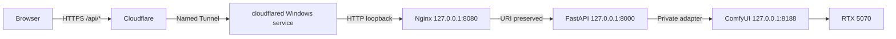

# Contract: Named Tunnel and Loopback Nginx

## Production route



The public hostname is `mango74-api.mangosgo.com`. The Tunnel service target is
exactly `http://127.0.0.1:8080`. Cloudflare and `cloudflared` preserve the
public request path; no direct-IP fallback exists.

## Cloudflare administrative contract

The authorized Zone administrator:

1. creates or selects one named, remotely managed Tunnel;
2. publishes only the approved API hostname to the loopback service URL;
3. confirms Cloudflare-issued public HTTPS for the hostname;
4. supplies the connector token to the Notebook operator through a secure,
   out-of-repository channel;
5. records a redacted route identifier and rollback procedure;
6. keeps unrelated `www.mangosgo.com` routing unchanged.

The production connector runs as a Windows service and reconnects outbound.
The token is never placed in a repository file, task output, screenshot,
evidence document, or ordinary process log. Stopping the service makes the API
unavailable; it must not expose another route. Restarting it restores the same
public hostname.

## Nginx listener contract

Nginx must satisfy all of the following:

- bind only `127.0.0.1:8080`;
- accept the exact API host and reject unmatched host/default-server traffic;
- proxy exact `/api` and `/api/*` only to `127.0.0.1:8000`;
- preserve `/api/v1/...` by using `proxy_pass` without a URI component;
- never proxy ComfyUI or port `8188`;
- set/overwrite a safe request-correlation header;
- pass the intended host and forwarding scheme safely;
- return generic `404`, `413`, `502`, `503`, and `504` responses without
  internal addresses, paths, stack traces, or product details;
- use a 12 MiB request framing limit while FastAPI enforces 10 MiB content;
- apply bounded connect, send, and read timeouts compatible with asynchronous
  job submission and artifact download;
- disable proxy caching and preserve backend `no-store` semantics for jobs and
  GLBs;
- rotate access/error logs and never log request bodies, response bodies,
  cookies, authorization values, or `X-Job-Token`.

Representative URI mapping:

| Public request | FastAPI receives |
|---|---|
| `/api/v1/jobs` | `/api/v1/jobs` |
| `/api/v1/jobs/{id}` | `/api/v1/jobs/{id}` |
| `/api/v1/jobs/{id}/cancel` | `/api/v1/jobs/{id}/cancel` |
| `/api/v1/jobs/{id}/model` | `/api/v1/jobs/{id}/model` |
| `/api/v1/jobs/{id}/download` | `/api/v1/jobs/{id}/download` |
| `/`, `/mango74/`, `/comfyui` | Rejected; never proxied |

## Windows process contract

The official Nginx Windows archive is stored outside version control and
verified against an operator-approved SHA-256 before service installation.
WinSW supervises `Local3D-Nginx` because the Windows Nginx distribution is a
console application. Configuration validation (`nginx -t`) must pass before
start or reload. Graceful stop/reload behavior, automatic restart bounds, log
directories, working directory, and loopback listener are validated on the
target Notebook.

Production service order:

```text
Local3D-ComfyUI -> Local3D-API -> Local3D-Nginx -> cloudflared
```

`Local3D-Web` is development-only after the NT Server cutover.
`Local3D-Caddy` is stopped and disabled before Nginx acquires port 8080. Caddy
may remain only as the documented rollback artifact and cannot run
simultaneously on the same listener.

## Negative boundary evidence

Local listener inventory must show only:

```text
127.0.0.1:8000  FastAPI
127.0.0.1:8080  Nginx
127.0.0.1:8188  ComfyUI
127.0.0.1:3000  optional development frontend only
```

No application port may bind `0.0.0.0`, `[::]`, a private LAN address, or an
observed public/NAT address. External direct-IP probing requires separate
network-administrator authorization; absence of a public Notebook address does
not block Tunnel-based acceptance.
