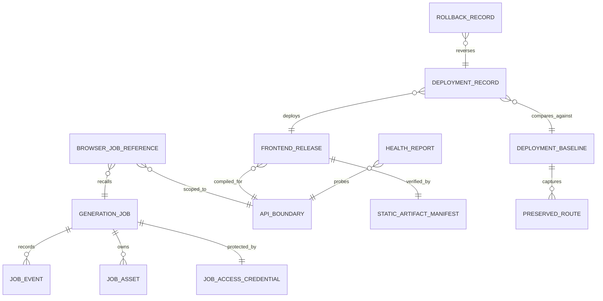
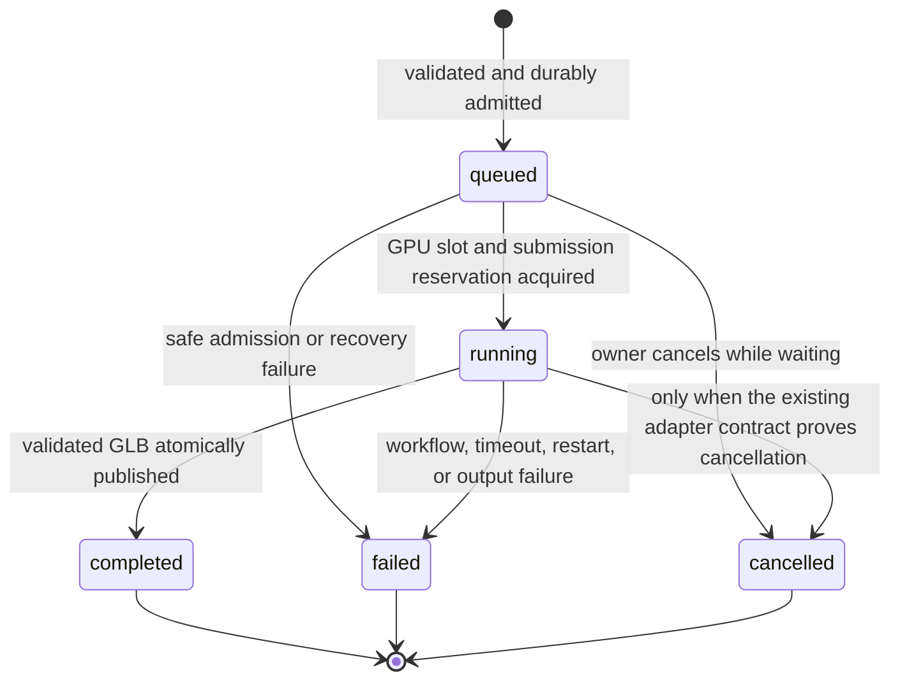

# Data Model: Mango74 Split-Origin Production Deployment

**Feature**: `005-nginx-mango74-deployment`

**Date**: 2026-09-09

Feature 005 preserves the durable generation model from Feature 004 and adds
deployment records needed to prove the static frontend, stable API, named
Tunnel, CORS policy, and independent rollback. Secrets are deliberately absent
from every documented or persisted deployment entity.

## Domain Relationships

## 1. Generation Job

Existing SQLite table: `generation_jobs`.

| Field | Type | Rules |
|---|---|---|
| `job_id` | UUID | Server-generated, opaque, unique |
| `token_digest` | string | One-way digest only; raw credential is never stored |
| `status` | enum | Persisted values: `queued`, `processing`, `completed`, `failed`, `cancelled` |
| `progress_percent` | integer/null | `0..100` when present |
| `progress_message` | string/null | Safe user-facing text only |
| `engine_job_id` | string/null | Private adapter identifier; never public |
| `workflow_revision` | string | Approved manifest revision used for the job |
| `input_asset_id` | UUID/null | References exactly one validated input |
| `output_asset_id` | UUID/null | References one finalized GLB only after validation |
| `error_code` | string/null | Allowlisted safe machine code |
| `error_message` | string/null | Safe text, at most 240 characters |
| `attempt_count` | integer | Non-negative; bounded by implementation policy |
| timestamps | UTC datetime | Created, queued, started, finished, expires, updated |

### Public state mapping

The stored `processing` value is serialized as public `running`. No ComfyUI
state or prompt identifier crosses the API boundary.

Terminal states never transition. A completed job exposes result locations
only while its authorized, finalized asset remains valid and retained.

## 2. Job Access Credential

| Field | Type | Rules |
|---|---|---|
| `raw_token` | 256-bit random capability | Returned once; browser memory/session storage only |
| `token_digest` | string | Stored with the job; constant-time verification |
| `job_id` | UUID | Credential authorizes exactly one job |

The raw token travels only in `X-Job-Token`, never in a URL, query string, log,
deployment record, or frontend archive.

## 3. Job Asset

Existing SQLite table: `job_assets` plus contained filesystem bytes.

| Field | Type | Rules |
|---|---|---|
| `asset_id` | UUID | Server-generated |
| `job_id` | UUID | Exactly one owning job |
| `kind` | enum | `input`, `intermediate`, or `output` |
| `relative_path` | string | Relative, normalized, no traversal or links outside job root |
| `content_type` | string | Verified server-side |
| `size_bytes` | integer | Non-negative and within approved bounds |
| `sha256` | lowercase hex | 64 characters |
| `created_at`, `expires_at` | UTC datetime | Retention policy applies |

Only one output asset may exist per job. A public output must be a complete,
validated `model/gltf-binary` file with `glTF` magic and an atomic final name.

## 4. Job Event

Existing SQLite table: `job_events`.

| Field | Type | Rules |
|---|---|---|
| `sequence` | integer | Monotonic and unique within one job |
| `event_type` | string | Allowlisted lifecycle/diagnostic category |
| `from_status`, `to_status` | enum/null | Must follow the state machine |
| `progress_percent` | integer/null | `0..100` |
| `safe_message` | string/null | No secret, path, input, or engine identifier |
| `created_at` | UTC datetime | Immutable |

## 5. API Boundary

Configuration entity; not stored in the job database.

| Field | Production value | Validation |
|---|---|---|
| `public_origin` | `https://mango74-api.mangosgo.com` | Exact HTTPS hostname; no path, query, fragment, credentials, or raw IP |
| `public_base_path` | `/api/v1` | Must remain below approved `/api/*` contract |
| `tunnel_origin` | `http://127.0.0.1:8080` | Exact loopback Nginx origin |
| `api_upstream` | `http://127.0.0.1:8000` | Exact loopback FastAPI upstream |
| `allowed_browser_origins` | `https://www.mangosgo.com` | Exact production list; no wildcard |
| `preview_origin` | empty by default | May be exactly `https://inw3d-ai-local.web.app` in test mode |
| `allow_credentials` | `false` | Change requires architecture approval |

The stable browser base is
`https://mango74-api.mangosgo.com/api/v1`. It is public configuration, not a
secret.

## 6. Browser Job Reference

Session-storage entity on the user's browser.

| Field | Type | Rules |
|---|---|---|
| `schema_version` | integer | Allows safe rejection of incompatible records |
| `api_origin` | normalized HTTPS origin | Must equal the current configured API origin |
| `job_id` | UUID | Opaque reference |
| `job_token` | string | Raw one-job capability; never placed in a URL |
| `last_known_status` | public state | Advisory only; API state remains authoritative |
| `stored_at` | UTC datetime | Used for safe expiry/cleanup |

The storage key is versioned and scoped to the normalized API origin. A local,
Firebase, or former Quick Tunnel record cannot be restored as a production
Mango74 job. A transport failure preserves the record and shows unavailable;
only an authenticated API 404 may show the missing/expired outcome.

## 7. Frontend Release

Repository-generated release metadata packaged with `front-end.zip`.

| Field | Type | Rules |
|---|---|---|
| `release_id` | string | UTC timestamp plus source revision or CI identifier |
| `source_revision` | Git commit/reference | Informational; no credentials |
| `built_at` | UTC datetime | ISO 8601 |
| `framework_version` | string | Next.js version used to build |
| `base_path` | string | Exactly `/mango74` |
| `trailing_slash` | boolean | Must be `true` |
| `api_base_url` | URL | Exactly the approved stable API base for production |
| `environment` | enum | `production` or `firebase-preview` |
| `archive_sha256` | lowercase hex | Computed after deterministic packaging |

Changing the API base requires a new release. A production release must not be
promoted from a preview build with a different API or base path.

## 8. Static Artifact Manifest

| Field | Type | Rules |
|---|---|---|
| `relative_path` | string | Must remain inside the archive |
| `size_bytes` | integer | Non-negative |
| `sha256` | lowercase hex | Per-file integrity |
| `media_class` | enum | `html`, `css`, `javascript`, `font`, `image`, `manifest`, `other_static` |

Validation rejects executables, Python files, databases, models, workflows,
uploads, GLBs, credentials, local environment files, source maps containing
private paths when not explicitly approved, and any disallowed extension. The
archive root must deploy only beneath `/mango74/`.

## 9. Deployment Baseline

Evidence record stored under `evidence/feature-005/`, never in SQLite.

| Field | Type | Rules |
|---|---|---|
| `captured_at` | UTC datetime | Before production change |
| `nt_server_platform` | string | Administrator-confirmed product/version |
| `deployment_interface` | string | Safe description; no password or token |
| `mango74_before_state` | status/destination/content hash | Supports rollback verification |
| `preserved_routes` | list | Representative non-Mango74 routes |
| `frontend_release_before` | identifier/hash | Previous release or absence |
| `backend_services_before` | list | Service names/states only |
| `listener_boundary_before` | list | Local bind addresses and ports |
| `rollback_action_reference` | string | Points to approved runbook, not credentials |

### Preserved Website Route

Each record contains path, expected status, final destination, selected safe
headers, and a content identity/hash. Requests containing private data or
session-specific content are excluded.

## 10. Deployment Record

| Field | Type | Rules |
|---|---|---|
| `deployment_id` | string | Unique release operation |
| `frontend_release_id` | string | Exact archive deployed |
| `backend_revision` | string | Exact repository revision/config version |
| `authorized_operators` | role/name reference | No account credentials |
| `started_at`, `finished_at` | UTC datetime | Actual timestamps |
| `actions` | ordered list | Sanitized commands or admin actions actually performed |
| `gate_results` | map | `pass`, `fail`, `blocked`, or `not_run` with evidence links |
| `outcome` | enum | `accepted`, `rolled_back`, `failed`, `incomplete` |

Production outcome cannot be `accepted` until all constitutional gates have
real target-environment evidence.

## 11. Health Report

| Scope | Meaning |
|---|---|
| `nt_frontend` | Exact `/mango74/` page and required assets are usable |
| `preserved_routes` | Baseline routes outside Mango74 remain unchanged |
| `stable_api_dns_tls` | Approved hostname resolves and HTTPS certificate is valid |
| `named_tunnel` | Connector is healthy and public hostname reaches Nginx |
| `nginx` | Loopback listener and exact host/path routing are correct |
| `api_live` | FastAPI process answers safely |
| `api_ready` | Storage, adapter, admission, and workflow config are ready |
| `comfyui` | Private workflow service is reachable |
| `gpu` | Approved RTX execution path is available |
| `listener_boundary` | Internal application ports are loopback-only |
| `cors` | Production allow and deny probes match the policy |

Each result has `checked_at`, `status`, `safe_reason_code`, `elapsed_ms`, and an
evidence reference. Reports must not contain Tunnel tokens, job tokens, user
content, internal filesystem paths, or raw model data.

## 12. Rollback Record

| Field | Type | Rules |
|---|---|---|
| `rollback_id` | string | Unique |
| `deployment_id` | string | Deployment being reversed |
| `boundary` | enum | `frontend`, `backend`, `tunnel`, or `combined` |
| `reason` | safe text | No secret or user content |
| `actions` | ordered list | Actual sanitized operations |
| `restored_release` | identifier/hash | Prior frontend/backend state |
| `job_state_summary` | counts by state | No job token or user asset |
| `preserved_route_results` | list | Rechecked baseline |
| `completed_at` | UTC datetime | Required for completed rollback |
| `verdict` | enum | `pass`, `fail`, `incomplete` |

Rollback never mutates a job merely to make validation pass. Durable job state
is reconciled through the existing recovery contract.
