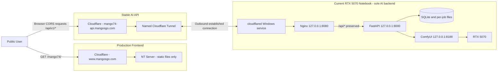

# Implementation Plan: NT-Hosted Mango74 Frontend and Stable AI API

**Branch**: `005-nginx-mango74-deployment` (logical feature; repository checkout
is `main`) | **Date**: 2026-09-09 | **Spec**: [spec.md](./spec.md)

**Input**: Feature specification at
`specs/005-nginx-mango74-deployment/spec.md` and Constitution 5.0.0.

## Summary

Preserve the validated Feature 004 generation service while replacing its
temporary same-host web entry with two production browser origins. The existing
NT Server serves only a compiled Next.js static frontend at
`https://www.mangosgo.com/mango74/`. That frontend calls the stable API at
`https://mango74-api.mangosgo.com/api/v1`, where Cloudflare sends requests
through an authorized named Tunnel to `cloudflared` on the current RTX 5070
Notebook. Nginx is the only Tunnel origin at `127.0.0.1:8080` and preserves the
existing FastAPI `/api/v1/*` contract at `127.0.0.1:8000`; FastAPI alone calls
ComfyUI at `127.0.0.1:8188`.

The implementation adds reproducible static export/packaging, an exact
environment-specific CORS allowlist, API-origin-scoped browser job recovery,
Nginx and named-Tunnel Windows operations, layered health evidence, and
independent frontend/backend rollback. It does not move AI state to the NT
Server, expose a Notebook port or IP, create a second AI node, or alter Feature
004 historical artifacts.

## Technical Context

**Language/Version**: Python 3.12.10 (`>=3.12,<3.13`); TypeScript 5.9.3 on
Node.js 24.19.0 and npm 11.17.0; PowerShell 5.1+; Nginx configuration syntax;
Cloudflare Tunnel configuration managed by the authorized administrator

**Primary Dependencies**: FastAPI 0.116.1, Uvicorn 0.35.0, Pydantic 2.11.7,
aiosqlite 0.21.0, httpx 0.28.1, Pillow 11.3.0, Next.js 16.3.4, React 19.2.8,
Three.js 0.185.1, React Three Fiber/Drei, ComfyUI with the approved Hunyuan3D
workflow, official Nginx for Windows, cloudflared 2026.8.3 currently observed,
and WinSW v2

**Storage**: Existing local SQLite database and per-job upload/work/output
directories on the AI Notebook; session storage for one browser job capability
scoped to the configured API origin; static frontend release and evidence
files only on the NT Server/repository

**Testing**: pytest 8.4.1 and pytest-asyncio 1.1.0; Ruff 0.12.10 and mypy
1.17.1; Vitest 4.1.11, Testing Library, Playwright 1.62.1, ESLint and TypeScript
typecheck; Next.js production static build; YAML/OpenAPI parsing; Nginx `-t`;
PowerShell parser/service checks; exact CORS matrix; named-Tunnel interruption;
authorized external browser acceptance; and controlled real ComfyUI/RTX 5070
validation

**Target Platform**: Compiled frontend on the existing administrator-managed NT
Server; one Windows Notebook with RTX 5070 for Nginx, cloudflared, FastAPI,
SQLite/files, ComfyUI, models, workflows, and GPU execution. The NT Server's
software/deployment adapter is recorded before cutover and does not change the
platform-neutral static artifact contract.

**Project Type**: Monorepo web application with a static frontend release, a
single-machine API/AI backend, external Cloudflare hostname/Tunnel routing, and
Windows operational tooling

**Performance Goals**: The frontend is usable within five seconds at p95 under
the recorded external test conditions; accepted job reference/token returns
within three seconds after upload transfer; durable status is restored within
ten seconds after browser reconnect; an operator identifies the failed layer
within two minutes; rollback completes within 15 minutes; every admitted job
completes or fails safely within the configured timeout

**Constraints**: Official frontend `/mango74/`; stable API
`mango74-api.mangosgo.com/api/v1`; two browser origins with exact CORS; public
frontend without site-wide sign-in; one backend Notebook; one active GPU job by
default; at most 20 pending jobs; JPEG/PNG at most 10 MiB; Nginx edge limit 12
MiB; 24-hour retention; admission stops below 10% free disk; loopback ports
8000/8080/8188 and optional development 3000; no direct inbound Notebook route;
no credential in source, archive, logs, or evidence

**Scale/Scope**: One static frontend release on one existing NT Server, one
stable API hostname, one named Tunnel connector, one Nginx/FastAPI/SQLite/
ComfyUI backend, one RTX 5070, five-user acceptance concurrency, bounded HTTP
polling, and no external database, queue, storage, or compute service

No unresolved planning clarification remains. The exact API origin is approved.
The NT Server product and deployment command are target-environment inventory
inputs before cutover, not changes to the application architecture.

## Constitution Check

*GATE: Passed before Phase 0 research and passed again after Phase 1 design.*

_REQ-005's conditional reference to Constitution 4.0.0 is satisfied by the
approved 5.0.0 amendment. Feature 004 remains historical and unchanged._

| Principle | Pre-research evaluation | Post-design evidence | Result |
|---|---|---|---|
| I. Single AI Backend Node and Frontend-Only NT Server | Existing AI/API/state already run on the RTX Notebook; NT Server receives static files only. | [frontend-hosting.md](./contracts/frontend-hosting.md) excludes backend/state files; the system map contains one AI backend. | PASS |
| II. Split Frontend and Stable API Connectivity | Both exact public boundaries are resolved; no direct Notebook address is needed. | API hostname, named Tunnel, Nginx origin, and negative ingress rules are fixed in [nginx-tunnel-routing.md](./contracts/nginx-tunnel-routing.md). | PASS |
| III. Backend Isolation and Nginx Tunnel Origin | Nginx replaces Caddy on loopback and FastAPI/ComfyUI remain private. | Routing contract preserves `/api/v1/*`, rejects other hosts/paths, and never exposes ComfyUI. | PASS |
| IV. Production and Preview Separation | Production, Firebase preview, and Quick Tunnel have distinct roles. | Build/release model pins the official frontend/API; Firebase permission is optional and independently revocable. | PASS |
| V. Cross-Origin Browser Security and Secrets | Exact production origin and job-token boundary are compatible with FastAPI middleware. | [cors-and-browser-security.md](./contracts/cors-and-browser-security.md) defines allow/deny, preflight, credentials-off, token, and transport-error tests. | PASS |
| VI. Reliability and Resource Control | Feature 004 durable queue, timeouts, storage, and recovery remain valid. | [data-model.md](./data-model.md) preserves state transitions and adds API-scoped browser recovery plus independent rollback. | PASS |
| VII. Testing and Observability | New boundaries require static, CORS, Tunnel, NT Server, external, and rollback evidence. | [quickstart.md](./quickstart.md) and [operator-health-and-rollback.md](./contracts/operator-health-and-rollback.md) define automated and target-environment gates. | PASS |
| VIII. Scope Control | No new backend, cloud state, direct ingress, wildcard CORS, or framework migration is needed. | All changes remain inside the authorized frontend host, stable API, named Tunnel, Nginx, and existing application. | PASS |

There are no constitutional violations or exceptions to justify. A later change
to either public origin, NT Server role, backend node count, Tunnel origin,
browser credential model, public listener, reverse proxy, external state, or AI
workflow stops implementation until governance and design artifacts are
approved again.

## System Design



### Trust boundaries

| Boundary | Trusted responsibility | Explicitly excluded |
|---|---|---|
| Browser/compiled frontend | Input UX, stable API client, API-scoped session job capability, polling, preview/download | Secrets, direct Notebook/ComfyUI access, backend state authority |
| NT Server | `/mango74/` redirect and static files, static cache policy, unrelated-route preservation | API, jobs, Python/Node runtime, models, outputs, GPU |
| Cloudflare frontend zone | Existing HTTPS and website routing | Changing unrelated paths |
| Cloudflare API hostname/Tunnel | Stable HTTPS API entry, outbound Tunnel transport, platform security controls | Job authentication, durable state, direct origin fallback |
| Nginx | Exact Host/path allowlist, request bounds/timeouts, safe proxy errors, correlation, loopback upstream | CORS business policy, job authorization, ComfyUI exposure |
| FastAPI | CORS policy, validation, admission, job capability checks, durable lifecycle, safe errors, GLB publication | Public binding, browser cookies, multiple dispatch workers |
| ComfyUI adapter | Approved workflow mapping and private engine-state translation | Public API, tokens, durable job truth |
| SQLite/filesystem | Durable jobs/events/assets and isolated bytes | Raw tokens, public URLs, arbitrary paths |

## Frontend Design

### Static build and release

- Extend the current conditional export configuration without migrating
  Next.js. Production export uses `/mango74`, trailing slash output, and the
  approved absolute API base.
- Keep the current local development rewrite only for local development. It is
  excluded from static production behavior.
- Centralize URL construction in the frontend API client. All operations and
  relative resource locations resolve against one validated `URL` base.
- Fail production build/package validation when the API base is absent, not
  HTTPS, a raw IP, local/private, or `trycloudflare.com`.
- Replace the Feature 004 temporary-test notice in the production build with a
  production/public-service notice while retaining an explicit preview label
  for Firebase.
- Generate `front-end.zip`, a release manifest, per-file hashes, and an archive
  hash. Reject backend/runtime/secret/private content.

### Browser job recovery

The browser stores one versioned job reference in session storage under a key
scoped to the normalized API origin. The API remains authoritative after
refresh. Transport failures retain safe local state and show “AI service
unavailable”; only a readable API `404 job_not_found` produces the missing-job
message. The raw job token remains in the `X-Job-Token` header and never enters
the URL.

### NT Server adapter

The repository produces a platform-neutral archive and validation contract.
The authorized administrator supplies the target-specific copy/publish,
redirect, fallback, cache, and rollback commands after recording the current
server product/version. This prevents the plan from inventing Apache, IIS,
Nginx, or another server configuration without evidence.

## API and CORS Design

The existing API routes remain `/api/v1/*`; no database migration or job state
change is required. Add validated environment settings for production origins
and optional preview permission, then install CORS middleware during app
creation so tests can create isolated applications with explicit policies.

Production policy:

```text
Allowed origin:       https://www.mangosgo.com
Optional test origin: https://inw3d-ai-local.web.app (disabled by default)
Methods:              GET, POST, OPTIONS
Request headers:      Accept, Content-Type, X-Job-Token
Credentials:          false
Wildcard origin:      forbidden
```

The test matrix independently proves origin enforcement and job-token
enforcement. Nginx does not synthesize a second CORS policy. API responses keep
safe root-relative `/api/v1/...` resource paths; the browser resolves them
against the configured API origin. Public/error response scans reject local,
Notebook, ComfyUI, temporary Tunnel, filesystem, and secret values.

The external contract is [openapi.yaml](./contracts/openapi.yaml).

## Nginx and Named Tunnel Design

### Nginx

- Pin an official Windows Nginx build and verify the operator-approved SHA-256;
  do not commit the executable/archive.
- Add a dedicated loopback configuration with a rejecting default server and
  an exact `mango74-api.mangosgo.com` server.
- Preserve `/api/*` by using a no-URI `proxy_pass` to
  `http://127.0.0.1:8000`.
- Reject `/`, `/mango74/`, ComfyUI routes, unmatched hosts, and malformed paths.
- Enforce a 12 MiB request framing limit, bounded proxy timeouts, no caching,
  safe generic errors, sanitized rotating logs, and an overwritten correlation
  header.
- Supervise `Local3D-Nginx` through WinSW with configuration test before start
  or reload and a verified graceful stop path.

Nginx for Windows effectively processes with one active worker; this is
acceptable for the current low-volume request proxy because GPU dispatch is
already limited to one active job. Target evidence must still cover five-user
HTTP polling and artifact transfer without unsafe failure.

### Migration from Caddy

1. capture the healthy Feature 004 backend baseline;
2. stop and disable `Local3D-Caddy` so port 8080 is free;
3. validate/start `Local3D-Nginx` on the same loopback port;
4. update health/service scripts to use Nginx and remove the production
   dependency on `Local3D-Web`;
5. keep Caddy config/binary only as a disabled rollback artifact until rollback
   evidence passes.

### Named Tunnel

The authorized administrator creates a remotely managed named Tunnel and maps
the exact API hostname to `http://127.0.0.1:8080`. The Notebook installs the
connector as a Windows service from a securely transferred token. The token is
never committed or copied into evidence. Quick Tunnel scripts remain Feature
004 test tooling and cannot satisfy production acceptance.

Startup order is ComfyUI, FastAPI, Nginx, local health, then cloudflared.
Shutdown reverses public reachability first. Connector interruption leaves the
NT frontend online and never enables direct fallback. Reconnection restores
the same stable hostname.

## Generation, Storage, and Recovery

Feature 004 remains the implementation baseline:

- SQLite is the durable job/event/asset authority;
- one dispatcher owns the RTX 5070 slot;
- raw job credentials are never persisted;
- public states are queued, running, completed, failed, and cancelled;
- queued cancellation is durable and token-authorized;
- validated uploads and finalized GLBs stay in UUID-scoped paths;
- incomplete, missing, corrupt, or cross-job outputs are never served;
- uncertain engine submission is not blindly replayed after restart;
- retention, free-disk, rate, duplicate, pending-job, and timeout bounds remain
  unchanged unless separately approved.

The split deployment adds no data migration. Backend/Tunnel restart and
rollback operate on the same SQLite/filesystem state. The frontend can be
rolled back independently because it owns no durable job truth.

See [data-model.md](./data-model.md).

## Configuration and Secret Management

Committed examples contain non-secret shape/defaults only. Planned settings
include:

| Setting | Scope | Production rule |
|---|---|---|
| `MANGO74_STATIC_EXPORT` | build | Enables reviewed static-only output |
| `NEXT_PUBLIC_BASE_PATH` | build | Exactly `/mango74` |
| `NEXT_PUBLIC_API_BASE_URL` | build/browser | Exactly `https://mango74-api.mangosgo.com/api/v1` |
| `CORS_ALLOWED_ORIGINS` | FastAPI | Exactly `https://www.mangosgo.com` |
| `CORS_PREVIEW_ORIGIN_ENABLED` | FastAPI | `false` by default |
| existing job/GPU/storage settings | FastAPI | Preserve Feature 004 validated bounds |

The Cloudflare connector token, Nginx binary, WinSW binary, local runtime
configuration, models, uploads, outputs, and evidence containing private data
remain ignored and access-controlled outside tracked source. The public API URL
is not a secret, but packaging validates it to prevent accidental environment
leakage.

## Observability and Health

Health reporting distinguishes the NT frontend, preserved website routes,
stable API edge, named Tunnel, Nginx, FastAPI, storage/admission, workflow,
ComfyUI, GPU, CORS, and listener boundary. Public endpoints return only coarse
safe status. Local reports record component result, reason code, duration, and
UTC time without tokens, user content, model bytes, local paths, or Tunnel
credentials.

Nginx logs route class/status/duration and a generated correlation value. It
does not log request or response bodies, credentials, cookies, authorization,
or the job-token header. FastAPI logs continue to use safe job ID/event fields.
Cloudflared remains at information or safer logging during user traffic.

See
[operator-health-and-rollback.md](./contracts/operator-health-and-rollback.md).

## Deployment and Rollback Strategy

### Phase A: Inventory and backup

- name the authorized Cloudflare and NT Server operators;
- identify NT Server product/version and exact deployment interface;
- record `/mango74` plus representative unrelated-route behavior;
- record Cloudflare hostname/Tunnel rollback state;
- record Notebook services, listeners, workflow, models, GPU, and sanitized job
  counts;
- create independently restorable frontend and backend configuration backups.

### Phase B: Repository and isolated validation

- add failing tests for static pathing, API URL validation, error
  classification, API-scoped session state, exact CORS, Nginx routes, service
  definitions, packaging, and secret scans;
- implement the smallest compatible changes;
- run the complete existing and new automated suites;
- build and scan `front-end.zip`.

### Phase C: Local backend cutover

- stop Caddy only after safe job/service prechecks;
- validate and install Nginx, update Windows service dependencies, and confirm
  loopback-only listeners;
- run mock API flow, CORS matrix, failure matrix, restart recovery, and the
  approved real workflow check without needlessly repeating expensive GPU work.

### Phase D: Named Tunnel activation

- authorized administrator provisions the exact hostname/Tunnel;
- securely install the connector service;
- verify public HTTPS, stable route, interruption/reconnection, and absence of
  direct fallback before deploying the frontend.

### Phase E: NT frontend deployment

- hand off only the reviewed archive/hash/contract;
- authorized administrator deploys `/mango74/` and the one redirect;
- verify assets, navigation, deep links, cache behavior, and unchanged unrelated
  routes.

### Phase F: External acceptance and rollback rehearsal

- from a genuine external network, perform exact CORS tests and one real
  end-to-end generation through both public origins;
- verify refresh, cancellation, state, result authorization, GLB integrity,
  and response redaction;
- run three controlled service-restart trials;
- execute frontend-only rollback and backend/Tunnel-only rollback separately;
- revalidate unrelated routes, durable state, and the direct-access boundary.

Production completion is evidence-gated. Missing administrator, external
network, service restart, or real-hardware evidence remains blocked/manual and
cannot be inferred from local tests.

## Validation Strategy

| Layer | Required evidence |
|---|---|
| Static quality | Ruff, mypy, ESLint, TypeScript, production build, YAML/OpenAPI parse, Nginx `-t`, PowerShell parse |
| Frontend artifact | `/mango74` base/trailing slash, complete asset crawl, stable API references only, content allowlist, per-file/archive hashes, no secret/private/backend content |
| Browser behavior | Cross-origin create/status/cancel/preview/download, refresh recovery, API-scoped storage, transport unavailable distinct from API 404, Firebase permission off/on |
| API/CORS | Exact production origin succeeds; HTTP/look-alike/port/subdomain/null/arbitrary origins denied; methods/headers minimal; credentials absent; token isolation independent |
| API contract | Existing success/error/status/resource contracts, relative resource URL resolution, no internal URL/path disclosure |
| Job/recovery | FIFO, one active GPU slot, queue/capacity/disk bounds, timeout, cancellation race, durable restart, orphan/missing/corrupt output behavior |
| Nginx | Exact Host and `/api/*`, URI preserved, non-API/default rejected, upload/timeouts/no-cache/errors/log redaction, loopback listener |
| Tunnel | Named stable hostname, only Nginx origin, Windows service, outbound reconnect, stop/restart same URL, no direct fallback |
| NT Server | One redirect, page/assets/deep links, static-only artifact, unrelated routes unchanged before/after deploy and rollback |
| Hardware | Approved manifest/runtime and existing RTX baseline plus one production-path real job when external acceptance requires it |
| Rollback | Frontend and backend/Tunnel reversal independently within 15 minutes; no data migration, loss, duplicate, or false completion |
| Security | Listener and portproxy inventory, authorized external boundary evidence, job-token isolation, compiled/repository/evidence secret scans |

Before editing Next.js source, implementation must re-read the applicable local
Next.js 16 documentation under `apps/web/node_modules/next/dist/docs/`, as
required by `apps/web/AGENTS.md`.

## Project Structure

### Documentation (this feature)

```text
specs/005-nginx-mango74-deployment/
├── plan.md
├── research.md
├── data-model.md
├── quickstart.md
├── contracts/
│   ├── openapi.yaml
│   ├── frontend-hosting.md
│   ├── cors-and-browser-security.md
│   ├── nginx-tunnel-routing.md
│   └── operator-health-and-rollback.md
└── tasks.md                         # Created later by $speckit-tasks
```

### Existing and planned source layout

```text
apps/
├── api/
│   ├── src/local3d/
│   │   ├── api/                     # Existing job and health routes
│   │   ├── config.py                # Add validated CORS environment policy
│   │   ├── main.py                  # Install CORS middleware
│   │   ├── domain/                  # Existing job state model
│   │   ├── persistence/             # Existing SQLite model
│   │   └── services/                # Existing queue/storage/recovery
│   └── tests/
│       ├── contract/                # Stable public contract and CORS
│       ├── integration/             # Lifecycle/recovery/Tunnel-adjacent behavior
│       └── security/                # Origin/token/redaction isolation
└── web/
    ├── app/                          # Static App Router pages/layout
    ├── components/                   # Generation/status/result UI
    ├── lib/api/                      # Central configured stable API client
    ├── lib/jobs/                     # API-scoped browser restoration/polling
    ├── tests/unit/                   # URL, storage, error, base-path behavior
    ├── tests/e2e/                    # Isolated cross-origin browser flows
    └── next.config.ts                # Static export, basePath, trailingSlash

deploy/
├── nginx/                            # Planned loopback config and safe errors
├── cloudflared/                      # Named-Tunnel operator documentation only
└── windows/services/                 # Planned Local3D-Nginx WinSW definition

scripts/
├── windows/                          # Build/package, Nginx service, health/recovery
└── verify/                           # Artifact, public route, CORS, external acceptance

artifacts/                            # Ignored generated front-end.zip and hashes
evidence/feature-005/                 # Sanitized performed validation only
workflows/hunyuan3d/                  # Existing approved workflow/manifest
storage/                              # Existing ignored durable runtime state
```

**Structure Decision**: Keep the existing `apps/web` and `apps/api` monorepo
layout and extend only the deployment, validation, and Feature 005 artifacts
required by the split-origin release. No new application service, package,
database, queue, or cloud runtime is introduced.

## Complexity Tracking

No Constitution violation or approved exception exists; complexity tracking is
therefore not required. The NT Server is an existing static host, not a second
AI/application backend, and the named Tunnel replaces temporary public routing
rather than adding another compute tier.
